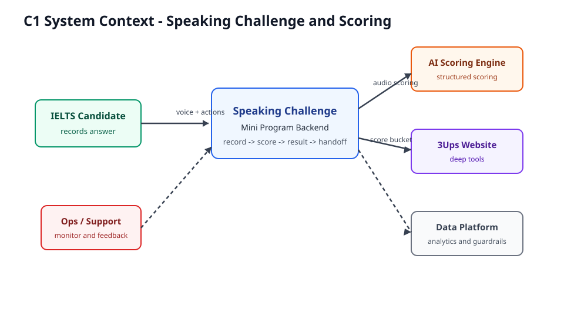
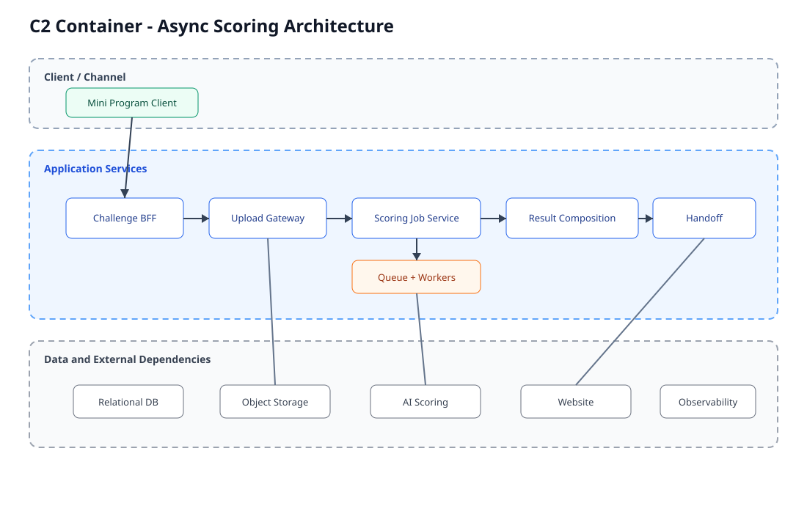
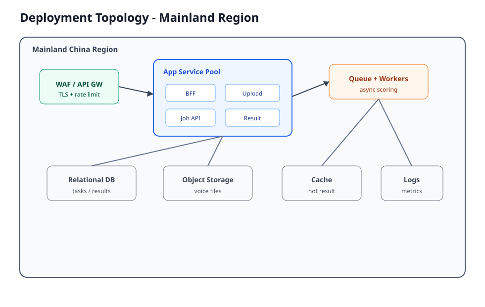
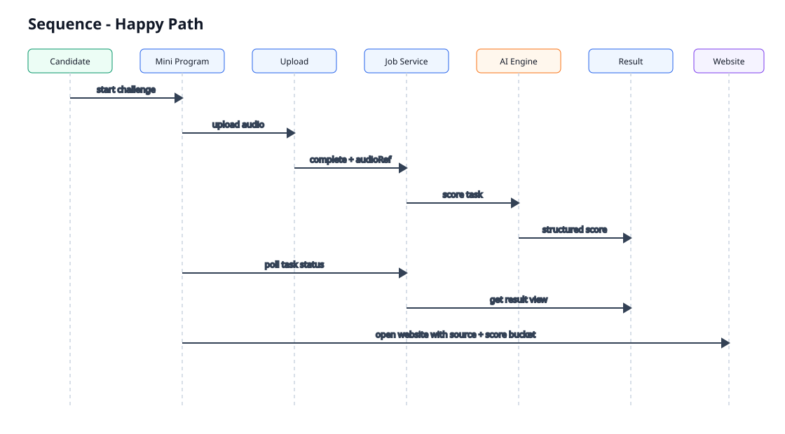
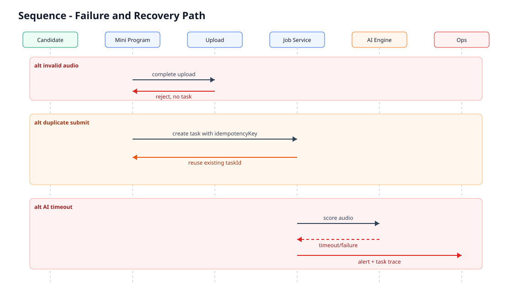
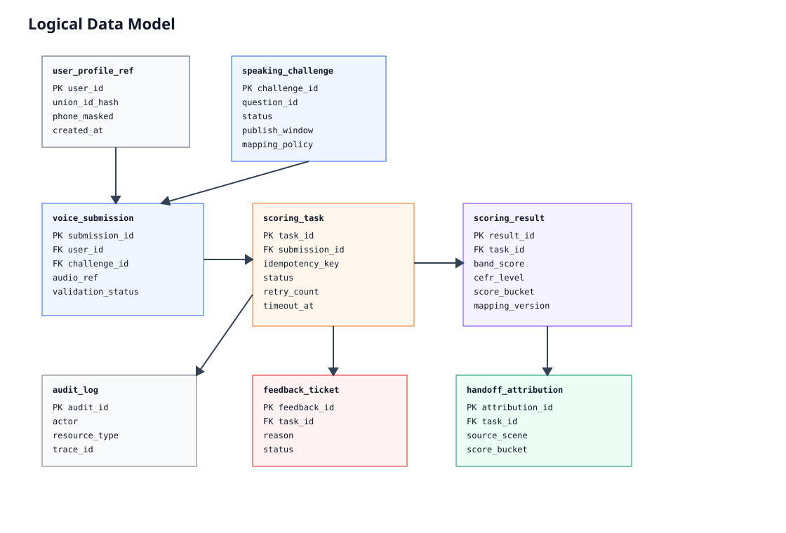
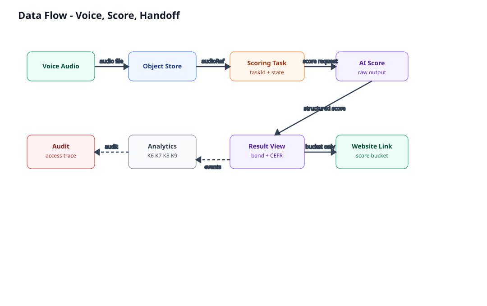

## §0 Architecture Brief

本架构覆盖 `speaking-challenge-and-scoring` Epic 的端到端 MVP：小程序口语挑战入口、录音上传、异步 AI 评分、短轮询结果查询、IELTS band/CEFR 映射、可信度说明、基础提分建议、website 深链导流和关键 guardrail 监控。

目标状态是一个以异步评分任务为中心的轻量 TOC 架构：小程序端只负责录音采集、基础校验和状态展示；后端拆分为 Challenge BFF、Upload Gateway、Scoring Job Service、Result Composition Service、Content Mapping Service、Handoff Attribution Service 和 Ops/Observability；音频进入对象存储，任务与结果进入关系型库，AI Scoring Engine 作为外部或独立评分依赖接入。

关键设计意图：

| 设计主题 | 决策 |
|---|---|
| 评分链路 | 异步任务 + 短轮询，不在 MVP 引入 callback / WebSocket。 |
| 上传与任务 | 音频上传成功与评分任务创建分离建模，便于失败恢复和排查。 |
| 幂等性 | 创建评分任务必须基于用户、题目、音频引用和 client request id 生成幂等键。 |
| 结果安全 | website 深链只透传 source scene + score bucket + attribution id，不透传原始分数。 |
| NFR | 消费 project-wide NFR：API p95 <= 500ms，异步平均 <=20s，最大 <=30s，99.9% 可用性。 |

## §1 Layer 1: Context & Business Architecture

### §1.1 业务上下文

本 Epic 是 MVP 阶段 `mobile-speaking-challenge` 的核心价值单元，服务 TOC 雅思备考用户。业务目标是验证“移动端轻量口语作答 -> AI 评分 -> 结果解释 -> website 深度承接”的最短闭环。

对齐 KPI：

| KPI | 架构含义 |
|---|---|
| K1 周口语有效作答人数 >= 3000/week | 评分任务、用户作答和结果状态必须可稳定记录。 |
| K2 首次作答完成率 >= 45% | 录音、上传、任务创建路径需低摩擦且可恢复。 |
| K3 结果页到 website 导流点击率 >= 18% | 结果服务需稳定生成 score bucket 与导流归因。 |
| K6 评分结果成功返回率 >= 97% | AI 依赖失败、超时和重试需可观测。 |
| K7 平均返回时长 <=20s | 任务调度、短轮询间隔和评分 SLA 需围绕 20s 设计。 |
| K8 投诉率 <=1.5% | 结果解释、可信度说明和反馈入口需可追踪。 |
| K9 隐私事故 =0 | 录音、PII、评分结果需加密、授权和审计。 |

### §1.2 用户与外部 actors

| Actor | 类型 | 主要动作 | 量级 / 地域 |
|---|---|---|---|
| IELTS Candidate | Primary user | 进入挑战、录音、提交、查看结果、跳转 website | TOC，大陆，DAU 1k-10k |
| Content/Growth Ops | Internal actor | 配置题目、结果解释、导流策略 | 运营低并发 |
| Scoring Ops / Support | Internal actor | 查看任务状态、处理失败与投诉 | 运营低并发 |
| Mini Program Platform | External platform | 麦克风授权、录音能力、登录态 | 微信生态 |
| AI Scoring Engine | External/internal dependency | 消费音频并返回结构化评分 | [待 vendor / ownership 确认] |
| 3Ups / Website | Downstream system | 承接 score bucket 与归因参数 | TOC web |
| Touch Points / Data Platform | Downstream analytics | 归因、行为和 guardrail 指标分析 | 内部数据平台 |

### §1.3 C1 System Context Diagram



> **图源**：`fireworks-tech-graph` (风格: claude-official)  
> **manifest**: `diagrams-manifest.json#layer1-c1-system-context`  
> **上次生成**: 2026-05-22-1500

### §1.4 业务能力地图

| Capability | Owner | Notes |
|---|---|---|
| Challenge Discovery | Mini Program + Challenge BFF | 首页入口、列表、题目详情。 |
| Voice Capture & Validation | Mini Program + Upload Gateway | 麦克风授权、录音、空/过短/损坏拦截。 |
| Async Scoring Orchestration | Scoring Job Service | 任务状态机、幂等、重试、超时。 |
| Result Interpretation | Result Composition + Content Mapping | IELTS band、CEFR、建议、可信度说明。 |
| Website Handoff | Handoff Attribution Service + Website | score bucket、source scene、归因追踪。 |
| Trust & Guardrails | Ops/Observability + Support | K6/K7/K8/K9、反馈、投诉、审计。 |

### §1.5 合规与法规约束

- NFR Data Sensitivity = medium：录音、学习记录、用户标识、手机号按 PII/教育数据处理。
- Compliance = medium：等保二级 + 教育部备案；默认不做数据出境。
- Retention = medium：录音、评分结果、任务状态和审计日志 3 年，临时上传缓存 <=7 天。
- 评分结果必须展示“练习参考，非官方成绩”，并避免在 website 深链透传原始敏感分数。

## §2 Layer 2: Solution Architecture

### §2.1 C2 Container Diagram



> **图源**：`fireworks-tech-graph` (风格: claude-official)  
> **manifest**: `diagrams-manifest.json#layer2-c2-container`  
> **上次生成**: 2026-05-22-1500

### §2.2 Service Boundary Table

| Service / Component | Owns | Does NOT Own | Notes |
|---|---|---|---|
| Mini Program Client | 录音交互、麦克风授权、基础时长校验、短轮询 UI、结果页 CTA | 评分逻辑、最终有效性判定、敏感分数跨端传输 | 客户端校验只做前置体验，不作为安全边界。 |
| Challenge BFF | 题目读取、挑战入口聚合、登录态适配、前端 API 编排 | 题目内容生产、AI 评分、对象存储实现 | 可与现有小程序 BFF 复用。 |
| Upload Gateway | 上传凭证、音频格式/大小校验、对象存储引用、临时对象清理 | AI 评分和结果解释 | 服务端有效性校验必须阻止无效录音进入评分。 |
| Scoring Job Service | 幂等任务创建、任务状态机、队列投递、重试、超时、taskId 查询 | AI 模型内部算法 | 核心事务边界。 |
| AI Scoring Engine | 音频评分、分维度结果、置信度/错误码 | 用户体验、导流归因、合规文案 | vendor / ownership 待确认。 |
| Result Composition Service | band/CEFR 映射、建议模板、可信度说明、结果聚合 | 原始模型训练、题目运营 | 映射口径需版本化。 |
| Handoff Attribution Service | source scene、score bucket、attribution id、点击/到达归因 | website 商品/购买流程 | 不传原始分数。 |
| Ops & Observability | K6/K7/K8/K9 指标、日志、trace、失败任务视图 | 人工客服结论 | 需统一 traceId/taskId。 |

### §2.3 Deployment Topology



> **图源**：`fireworks-tech-graph` (风格: claude-official)  
> **manifest**: `diagrams-manifest.json#layer2-deployment-topology`  
> **上次生成**: 2026-05-22-1500

部署建议：

| Layer | Deployment | Rationale |
|---|---|---|
| Edge | API Gateway / WAF / TLS termination | 统一鉴权、限流、基础防护。 |
| App | Stateless BFF, Upload Gateway, Job Service, Result Service | 支持水平扩展和滚动发布。 |
| Async | Managed Queue + worker pool | 解耦评分 SLA 与用户请求时延。 |
| Data | Relational DB + Object Storage + Cache | 任务强一致、音频大对象、热点结果缓存。 |
| Observability | Log/Metric/Trace pipeline | 支撑 K6/K7/K8/K9。 |

### §2.4 Runtime Stack

| Component | Runtime direction | Status |
|---|---|---|
| Mini Program Client | 微信小程序原生 / Taro 等现有栈 | [待 Tech Lead 确认] |
| BFF / API services | .NET / Java / Node.js 均可，优先复用现有团队栈 | [待 Tech Lead 确认] |
| Async queue | Azure Service Bus / RabbitMQ / Kafka 等托管队列 | [待基础设施确认] |
| Database | Managed relational DB | 推荐用于任务、结果、配置和审计。 |
| Object Storage | Blob/Object Storage | 用于录音文件，需加密与生命周期。 |
| Observability | ELK / Datadog / Azure Monitor 等 | [待基础设施确认] |

### §2.5 集成方案 + Sequence

#### Happy Path



> **图源**：`fireworks-tech-graph` (风格: claude-official)  
> **manifest**: `diagrams-manifest.json#layer2-sequence-happy-path`  
> **上次生成**: 2026-05-22-1500

核心步骤：

1. 小程序请求题目并完成录音。
2. Upload Gateway 校验音频并落对象存储，返回 `audioRef`。
3. Scoring Job Service 基于 `idempotencyKey` 创建或复用 `taskId`。
4. Worker 调用 AI Scoring Engine，写入评分结果。
5. 小程序短轮询任务状态，成功后展示 Result Composition 输出。
6. 用户点击 website CTA，Handoff Attribution Service 生成归因并只透传 score bucket。

#### Failure Path



> **图源**：`fireworks-tech-graph` (风格: claude-official)  
> **manifest**: `diagrams-manifest.json#layer2-sequence-failure-path`  
> **上次生成**: 2026-05-22-1500

失败恢复策略：

| Failure | Response | User-visible recovery |
|---|---|---|
| 麦克风拒绝 | 客户端不允许提交 | 引导重新授权或返回题目详情。 |
| 无效录音 | Upload Gateway 拒绝，不建任务 | 提示重录。 |
| 重复提交 | 幂等复用 taskId | 返回既有处理中/结果状态。 |
| AI 超时 | Job Service 标记 timeout，保留 taskId | 继续等待、刷新、重新提交或稍后查看。 |
| 映射模板缺失 | Result Composition 使用通用模板 | 展示练习参考说明并隐藏局部模块。 |

### §2.6 Observability + CICD + Release Strategy

| Area | Architecture decision |
|---|---|
| Trace | 每次挑战生成 `traceId`，每个评分任务生成 `taskId`，跨 BFF、Upload、Job、AI、Result、Handoff 透传。 |
| Metrics | K6 成功返回率、K7 平均返回时长、p95 API、AI timeout rate、upload failure rate、duplicate submission rate。 |
| Logs | 结构化日志包含 service name、traceId、taskId、user pseudonym id、questionId、error code。 |
| Alerts | 评分成功率 <97%、平均评分时长 >20s、超时率异常、对象存储失败、队列积压。 |
| CI/CD | API 与 worker 分开部署；DB migration 使用向后兼容变更；灰度发布先低流量再全量。 |
| Release | Feature flags 控制新题目、新映射模板、新导流策略；支持快速关闭 website CTA。 |

### §2.7 Quality Attribute Scenarios (QAS)

| QAS ID | Source | Stimulus | Environment | Response | Response Measure | Tactics |
|---|---|---|---|---|---|---|
| QAS-1 Performance API | 用户 | 请求挑战详情、任务状态或结果 | 正常负载 <=1k QPS | API 返回可用响应 | p95 <=500ms | BFF 聚合、缓存、索引、限流。 |
| QAS-2 Async Scoring | 用户提交有效录音 | 评分任务进入队列 | 正常 AI 依赖可用 | 返回完整评分结果 | 平均 <=20s，最大 <=30s | Queue worker、短轮询、timeout、并发池。 |
| QAS-3 Availability | 用户提交评分 | 月度正常运行 | 系统保持服务可用 | SLA 99.9%，评分成功返回率 >=97% | 重试、降级、告警、状态恢复。 |
| QAS-4 Capacity | 运营活动带来流量峰值 | DAU 1k-10k，峰值 100-1k QPS | 系统水平扩展 | 单文件 <=10MB，年增长 <=500GB | 无状态服务、对象存储、队列缓冲。 |
| QAS-5 Security | 内部人员访问录音 | 生产数据环境 | 仅授权角色可访问并审计 | TLS + at-rest + 字段级加密 | RBAC、审计日志、脱敏。 |
| QAS-6 Retention | 数据到期 | 生命周期任务运行 | 临时缓存清理，正式数据冷热分层 | 录音/结果 3 年，临时上传 <=7 天 | Lifecycle policy、归档、删除任务。 |
| QAS-7 Region | 用户在大陆访问 | 大陆业务场景 | 数据在大陆境内处理 | 不出境 | 区域化存储和访问控制。 |

## §3 Layer 3: Component & Data Architecture

### §3.1 C3 Component Diagram

本 Epic 的复杂度主要集中在 Scoring Job Service、Result Composition Service 和 Upload Gateway。首版不额外产 C3 SVG，组件职责在 §2.2 和 §3.2-§3.4 中展开。

### §3.2 ERD / Logical Data Model



> **图源**：`fireworks-tech-graph` (风格: claude-official)  
> **manifest**: `diagrams-manifest.json#layer3-erd`  
> **上次生成**: 2026-05-22-1500

| Entity | Key fields | Ownership | Notes |
|---|---|---|---|
| user_profile_ref | user_id, union_id_hash, created_at | User service / BFF reference | 只存引用和脱敏标识。 |
| speaking_challenge | challenge_id, question_id, status, publish_window | Challenge BFF | 题目状态与入口展示。 |
| voice_submission | submission_id, user_id, challenge_id, audio_ref, validation_status | Upload Gateway | 记录有效录音与上传引用。 |
| scoring_task | task_id, submission_id, idempotency_key, status, retry_count, timeout_at | Scoring Job Service | 状态机核心。 |
| scoring_result | result_id, task_id, raw_score_ref, band_score, cefr_level, mapping_version | Result Composition | 原始评分引用与展示结果。 |
| handoff_attribution | attribution_id, task_id, source_scene, score_bucket, clicked_at | Handoff Attribution | website 深链归因。 |
| feedback_ticket | feedback_id, task_id, reason, status | Support/Ops | 投诉与反馈入口。 |
| audit_log | audit_id, actor, action, resource_type, trace_id | Observability | 录音访问、导出、删除审计。 |

### §3.3 Data Flow Diagram



> **图源**：`fireworks-tech-graph` (风格: claude-official)  
> **manifest**: `diagrams-manifest.json#layer3-data-flow`  
> **上次生成**: 2026-05-22-1500

### §3.4 API Contracts（OpenAPI 摘要）

| API | Method | Endpoint | Purpose | Auth | Retry / timeout |
|---|---|---|---|---|---|
| List Challenges | GET | `/api/challenges` | 首页/列表读取可用挑战 | mini program session | Client retry once; p95 <=500ms |
| Get Challenge Detail | GET | `/api/challenges/{challengeId}` | 题目详情与说明 | mini program session | Client retry once |
| Init Upload | POST | `/api/voice-submissions/upload-token` | 获取上传凭证和限制 | mini program session | Non-idempotent; timeout 2s |
| Complete Upload | POST | `/api/voice-submissions/{submissionId}/complete` | 服务端有效性校验并绑定 audioRef | mini program session | Idempotent by submissionId |
| Create Scoring Task | POST | `/api/scoring-tasks` | 创建或复用评分任务 | mini program session | Idempotent by idempotencyKey |
| Get Scoring Task | GET | `/api/scoring-tasks/{taskId}` | 短轮询查询状态 | mini program session | Poll every 2s up to 30s |
| Get Result | GET | `/api/scoring-tasks/{taskId}/result` | 获取展示结果 | mini program session | Cacheable after success |
| Create Handoff | POST | `/api/handoffs` | 生成 website 深链归因 | mini program session | Idempotent by taskId + sourceScene |
| Submit Feedback | POST | `/api/feedback` | 投诉/反馈入口 | mini program session | Non-critical retry |

错误模型：

| Code | Meaning | User handling |
|---|---|---|
| VALIDATION_AUDIO_TOO_SHORT | 录音过短 | 提示重录。 |
| VALIDATION_AUDIO_INVALID | 音频损坏/格式不支持 | 提示重录。 |
| TASK_DUPLICATE_REUSED | 重复提交复用 taskId | 展示既有状态。 |
| SCORING_TIMEOUT | AI 评分超时 | 继续等待、刷新、重新提交或稍后查看。 |
| SCORING_FAILED | AI 评分失败 | 失败恢复并保留 taskId。 |
| MAPPING_TEMPLATE_MISSING | 解释模板缺失 | 使用通用模板。 |
| HANDOFF_TARGET_MISSING | website 承接页缺失 | 降级默认承接页。 |

### §3.5 Data Contract / Schema Evolution

- `scoring_task.status` 采用枚举：created / queued / processing / succeeded / failed / timeout / cancelled。
- `scoring_result.mapping_version` 必填，用于追踪 IELTS band / CEFR / 建议模板口径。
- `score_bucket` 只允许 low / mid / high / unknown 等低敏分层，不允许包含原始分数。
- API response 必须兼容新增字段；客户端忽略未知字段。
- 结果解释模板使用版本化配置，发布新版本时保留旧结果的渲染口径。

### §3.6 Data Lineage & Retention

数据血缘：录音文件 -> voice_submission.audio_ref -> scoring_task.task_id -> AI scoring output -> scoring_result -> result page / handoff_attribution / analytics。

Retention：

| Data | Retention | Action |
|---|---|---|
| 临时上传缓存 | <=7 天 | 未绑定任务定期删除。 |
| 录音文件 | 3 年 | 1 年热 + 2 年冷；训练复用待授权确认。 |
| 评分任务/结果 | 3 年 | 支持历史结果和投诉排查。 |
| 审计日志 | 3 年 | 支撑访问追溯和合规检查。 |

### §3.7 Security Architecture（auth flow + 轻量 STRIDE）

认证授权：小程序登录态由现有用户体系提供；后端使用 session/token 映射到 `user_id`，所有评分任务 API 校验 task ownership。内部运营访问录音和任务详情必须基于 RBAC。

| STRIDE | 风险 | Mitigation |
|---|---|---|
| Spoofing | 用户伪造 taskId 查询他人结果 | taskId + user ownership 校验。 |
| Tampering | 修改 score bucket 或深链参数 | 深链参数签名和短 TTL。 |
| Repudiation | 无法追踪录音访问 | audit_log 记录 actor/action/resource/traceId。 |
| Information Disclosure | 原始分数或录音 URL 泄露 | 不在日志输出敏感字段；预签名 URL 短时有效。 |
| Denial of Service | 高频上传/轮询 | 限流、队列缓冲、poll interval。 |
| Elevation of Privilege | 运营越权访问录音 | RBAC + 审计 + 最小权限。 |

## §7 Cross-cutting Concerns（5 类）

### §7.1 Security Architecture

- 全链路 TLS，录音与评分结果 at-rest 加密。
- 手机号、用户标识、录音引用、原始评分引用在日志中脱敏。
- website 深链只传 source scene、score bucket、attribution id，并加签名/TTL。
- AI training reuse 需独立授权，不作为首版默认行为。

### §7.2 Quality Attribute Scenarios (QAS · 横切汇总)

QAS 由 project-wide NFR LATEST 消费：API p95 <=500ms、异步评分平均 <=20s / 最大 <=30s、99.9% 可用性、DAU 1k-10k、峰值 100-1k QPS、数据大陆境内驻留、保留 3 年。

### §7.3 Cost View

| Cost driver | Cost control |
|---|---|
| AI scoring calls | 无效录音拦截；重复提交复用 taskId；失败重试有限制。 |
| Object storage | 生命周期策略；临时缓存 <=7 天；冷热分层。 |
| Queue/worker | 按峰值并发弹性伸缩；超时任务停止重试。 |
| Observability | 关键指标高保真，长尾 debug 日志采样。 |

### §7.4 Reliability & DR Strategy

- Availability 目标 99.9%，不要求首版多 region。
- API 服务无状态，支持滚动发布和水平扩展。
- 队列任务至少一次投递，消费侧通过 taskId 幂等。
- DB 保存任务状态机，worker 崩溃后可基于 queued/processing timeout 重新调度。
- 对象存储启用版本/生命周期策略，避免临时文件无限增长。

### §7.5 Operability（运维交付清单）

| Checklist | Required |
|---|---|
| Dashboard | K6/K7、AI timeout、queue depth、upload failure、API p95。 |
| Alert | 成功率 <97%、平均耗时 >20s、队列积压、对象存储失败。 |
| Runbook | AI 依赖失败、任务卡住、导流 404、模板缺失。 |
| Audit | 录音访问、导出、删除、训练复用。 |
| Feature flag | 关闭 website CTA、切换通用结果模板、暂停新评分任务。 |

## §8 Architecture Decision Records (ADR)

本架构首版产出 3 条 ADR，独立落盘在 `adr/` 子目录：

| ADR | Decision |
|---|---|
| ADR-001 | 使用异步队列 + 短轮询承载评分链路。 |
| ADR-002 | 上传与评分任务分离，并以幂等键创建任务。 |
| ADR-003 | website 深链只传 score bucket 与归因参数。 |

## §9 Migration & Implementation Plan

| Phase | Work |
|---|---|
| P0 Foundations | 建立对象存储 bucket、DB schema、队列、traceId/taskId 规范、基础 Dashboard。 |
| P1 Scoring Pipeline | Upload Gateway、Scoring Job Service、AI adapter、短轮询状态 API。 |
| P2 Result & Trust | Result Composition、band/CEFR 映射版本、可信度说明、反馈入口。 |
| P3 Handoff & Analytics | Website 深链、score bucket、归因事件、K3/K5 追踪。 |
| P4 Hardening | 超时恢复、重复提交、模板缺失降级、审计和 runbook。 |

## §10 Risks & Open Questions

| ID | Risk / OQ | Impact | Owner |
|---|---|---|---|
| IT-OQ1 | 第三方 / 内部 AI scoring vendor 未确认。 | 影响 adapter、SLA、错误码和成本。 | Tech Lead + AI |
| IT-OQ2 | 技术栈、队列、对象存储和监控选型未确认。 | 影响 runtime stack 与 deployment topology。 | Tech Lead |
| IT-OQ3 | 评分平均 <=20s / 最大 <=30s 的统计口径待校准。 | 影响 QAS 验收口径。 | Tech Lead + PM |
| IT-OQ4 | IELTS band / CEFR 固定映射还是内部解释版映射待确认。 | 影响 Result Composition 与模板治理。 | PM + Eng |
| IT-OQ5 | 录音训练复用授权与删除机制待确认。 | 影响数据保留、审计和 AI 训练边界。 | Compliance + AI |
| IT-RISK1 | 已生成 PNG 主显示图并更新 manifest 为 `png_status=ok`；部分 sequence 图仍需后续视觉精修（标签过粗 / 右侧元素裁剪）。 | 不影响 PNG-first Wiki 发布链路；影响图的阅读体验。 | IT Architect |

## §11 Handoff to Eng Reviewer + Product Planner

给 Product Planner：

- PRD 的 Coverage Matrix 应追溯 Solution BP-H1 / BP-U1-U5 / BP-E1，并把本架构的任务状态机、幂等、超时恢复、模板缺失、导流降级转为 Story AC。
- PRD NFR Reference 应优先引用 project-wide NFR LATEST，若后续产出 Epic 级 NFR 则切换引用。

给 Eng Reviewer：

- 重点评审 Service Boundary、幂等键、任务状态机、AI adapter 超时/重试、数据保留、深链签名、K6/K7/K8/K9 可观测性。
- Architecture Challenge 应关注 vendor 未确认、技术栈未确认和 NFR 统计口径未确认三类风险。

Wiki Publisher handoff：

```text
Project: spk2challenge-miniprogram
Epic: EPIC-speaking-challenge-and-scoring
Architecture Ref: Project/spk2challenge-miniprogram/Architecture/speaking-challenge-and-scoring/LATEST.md
Target Wiki Paths:
  主页: /spk2challenge-miniprogram/speaking-challenge-and-scoring-PRD/architecture
  ADR: /spk2challenge-miniprogram/speaking-challenge-and-scoring-PRD/architecture/adr-{slug}
```

## §12 Changelog

- 2026-05-22-1500：创建首版 IT Architecture。消费本地 Value、Solution 和 project-wide NFR；产出 7 张强制 SVG、diagrams-manifest、3 条 ADR；初始 PNG 转换依赖不可用，manifest 曾标 pending 并在 §10 记录风险。
- 2026-05-22-1635：通过 Playwright Chromium 将 7 张 SVG 导出为 PNG 主显示图，更新 manifest `png_status=ok`，用于 Wiki Publisher v3.3.2 PNG-first 发布。
