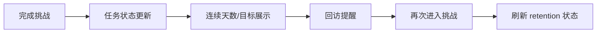
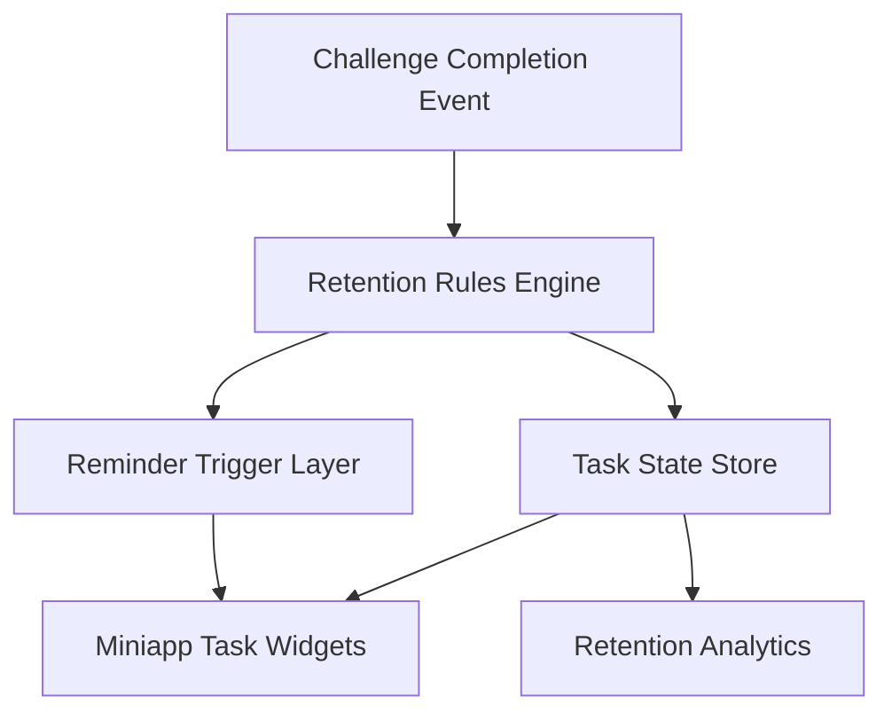

## §0 上游引用（Value Frame 摘要）

- 上游 Value：`EPIC E5 = challenge-retention-loop`
- Phase：Phase 2
- 目标 KPI：K1、K3、K4、K5、K8
- Epic 一句话：增强连续挑战、任务和复练留存机制
- 约束继承：小程序仍是轻量挑战入口；目标是提升 retention，而不是把小程序做成复杂课程体系。

## §1 Epic 定义

- **Epic Name**：Challenge Retention Loop
- **Epic Stable ID**：`EPIC-challenge-retention-loop`
- **Context**：本 Epic 在 MVP 能跑通挑战和评分后，进一步解决“为什么用户还会回来练”的问题。它负责用连续挑战、任务目标、再练提醒和轻量激励把单次完成转成稳定复练。它不负责 website 深度内容本身，但会和 website 导流策略协同，识别哪些用户更值得被承接到深度工具。
- **Scope In**：连续挑战、任务体系、复练提示、轻量激励、回访提醒、复练数据观察。
- **Scope Out**：重社交排行榜、复杂积分商城、完整 CRM 自动化、课程班级运营。
- **Personas**：
  - `P1`：雅思备考考生，需要目标感和持续练习动力。
  - `P2`：增长/运营同学，观察哪些 retention 机制最有效。

## §2 Feature List

| Feature ID | Name | Description | Value | 预估 Story 数 | T-shirt | 关联 Persona | 主要复杂度驱动 |
|---|---|---|---|---:|:---:|---|---|
| F1 | Streak and Task Goals | 设计连续挑战天数、每日任务和阶段性目标，让用户知道今天练什么、完成后获得什么，以及中断后会失去什么。 | 提升日常复练率和 7 日留存。 | 4–6 | M | P1, P2 | 任务粒度、状态持久化和目标展示 |
| F2 | Replay Triggers and Reminders | 在评分结果页、完成态和回访节点提供恰当的再练触发与提醒，推动用户从“知道要练”变成“现在就练”。 | 增加再次作答次数，减少首练后的流失。 | 3–5 | M | P1 | 触发时机、提醒频控和文案策略 |
| F3 | Retention Insight Layer | 让运营看到不同任务、提醒和挑战路径对复练率的影响，形成后续调优依据。 | 支撑 retention 优化闭环，避免只做静态规则。 | 3–4 | S | P2 | 数据口径定义、路径归因和看板设计 |

## §3 User Journey

| Persona ID | Stage ID | Stage | Action | Touchpoint | Emotion |
|---|---|---|---|---|---|
| P1 | J1 | Result | 完成一次挑战后看到连续练习状态 | 结果页/完成态 | 想知道练了有没有积累 |
| P1 | J2 | Commit | 接受今日任务或下一次挑战目标 | 任务卡片 | 有明确下一步 |
| P1 | J3 | Return | 在第二天或稍后回到小程序继续练习 | 首页回访卡片/提醒 | 被重新拉回 |
| P1 | J4 | Continue | 再次完成挑战并刷新连续状态 | 结果页/任务状态区 | 有成就感 |
| P2 | J5 | Analyze | 查看不同 retention 机制的表现 | 运营分析看板 | 判断该强化哪条策略 |

## §4 Business Process Flow

### Happy Path

用户完成一次挑战后，在结果页看到已完成状态和下一步任务。系统记录连续天数和当日任务完成状态，并在合适时间通过首页回访卡片或站内提醒再次触发。用户回到小程序后继续完成下一次挑战，连续状态被刷新。

### Unhappy Path 1：用户断签或中断连续挑战

- 触发点：用户超过设定时间未再次作答。
- 关键决策点：是直接清零还是保留缓冲补签。
- 系统边界：任务状态和连续天数由本系统维护。
- 异常恢复：展示“回归挑战”路径，避免流失用户直接归零后挫败。

### Unhappy Path 2：提醒过度导致打扰感

- 触发点：用户短时间收到过多再练提示。
- 关键决策点：提醒频控和静默策略是否生效。
- 系统边界：站内提醒由本系统控制，系统消息可能依赖外部能力。
- 异常恢复：降低频次并基于行为状态做分层触发。

## §5 GWT Top 3–5

| Scenario ID | Type | Persona | Name | 关联 Stage | 关联 Feature |
|---|---|---|---|---|---|
| S1 | happy | P1 | 完成挑战后加入连续练习 | J1, J2, J4 | F1, F2 |
| S2 | unhappy | P1 | 断签后回归挑战 | J3, J4 | F1, F2 |
| S3 | edge | P1 | 提醒频控生效避免打扰 | J3 | F2 |
| S4 | happy | P2 | 查看 retention 机制效果 | J5 | F3 |

### S1：完成挑战后加入连续练习

GIVEN 用户已完成一次口语挑战并拿到评分结果
WHEN 用户查看完成态或结果页任务区
THEN 系统展示当前连续状态和下一次挑战目标
AND 用户可直接点击进入下一次练习或接受今日任务

### S2：断签后回归挑战

GIVEN 用户曾连续完成过多次挑战
AND 在设定周期内未继续作答
WHEN 用户重新打开小程序
THEN 系统展示回归挑战入口
AND 明确说明当前连续状态的变化
AND 提供低门槛重新开始路径

### S3：提醒频控生效避免打扰

GIVEN 用户近期已多次看到再练提醒
WHEN 系统判断当前提醒频次达到上限
THEN 本周期内不再重复展示强打扰提醒
AND 保留较轻量的首页任务提示

### S4：查看 retention 机制效果

GIVEN 系统已记录任务完成、回访和再次作答行为
WHEN 运营同学打开 retention 看板
THEN 可查看不同任务策略和提醒入口带来的复练表现
AND 支持按时间和入口进行对比

## §6 Phase-level Workload（T-shirt 映射）

| Feature | T-shirt | Unit Range | Effort Range | 主要复杂度驱动 |
|---|:---:|---:|---:|---|
| F1 | M | 10–20 units | 5–10 days | 任务和连续状态规则 |
| F2 | M | 10–20 units | 5–10 days | 再练触发时机和提醒频控 |
| F3 | S | 5–10 units | 2.5–5 days | retention 口径与分析看板 |
| **Epic 合计** | — | **25–50 units** | **12.5–25 days** | — |

## §7 Tech High-level

### 1. 架构图

### 2. 关键组件清单

| 组件 | 职责 | 归属服务 |
|---|---|---|
| Retention Rules Engine | 计算连续状态、任务完成和触发条件 | Growth Service |
| Task State Store | 存储用户任务和连续挑战状态 | User Progress Store |
| Reminder Trigger Layer | 根据条件触发站内提醒和回访入口 | Miniapp Growth Layer |
| Retention Analytics | 汇总 retention 相关指标和路径表现 | Data Analytics |

### 3. Service Interaction Flow

- 链路 1：挑战完成事件 → Rules Engine 更新连续状态与任务完成度。
- 链路 2：Rules Engine 判断是否展示下一次挑战任务和回访提醒。
- 链路 3：用户再次进入小程序 → 任务组件根据状态展示不同文案。
- 链路 4：行为数据汇总 → Retention Analytics 看板供运营复盘。

### 4. 主要 ADR（待研发评审确认）

- ADR-1：连续挑战是否允许补签，当前倾向 MVP 不做补签，只做“回归挑战”缓冲以降低规则复杂度。
- ADR-2：提醒以站内入口为主还是叠加模板消息，当前倾向先做站内入口和结果页触发，避免过早打扰用户。

## §8 Story List 预览

### F1 — Streak and Task Goals

- `EPIC-challenge-retention-loop-F1-S01` — 连续状态展示：完成后展示当前 streak 和任务目标。
- `EPIC-challenge-retention-loop-F1-S02` — 每日任务生成：按规则生成今日挑战任务。
- `EPIC-challenge-retention-loop-F1-S03` — 中断后回归入口：断签用户可重新进入挑战路径。

### F2 — Replay Triggers and Reminders

- `EPIC-challenge-retention-loop-F2-S01` — 结果页再练触发：在结果页提供下一次练习入口。
- `EPIC-challenge-retention-loop-F2-S02` — 首页回访卡片：回访用户看到当前任务和回归入口。
- `EPIC-challenge-retention-loop-F2-S03` — 提醒频控：防止重复强提醒造成打扰。

### F3 — Retention Insight Layer

- `EPIC-challenge-retention-loop-F3-S01` — retention 看板：展示任务、回访和复练表现。
- `EPIC-challenge-retention-loop-F3-S02` — 入口效果对比：按不同触发入口分析效果差异。

## §9 Open Questions（含 Value 继承）

### 来自 Value Frame（继承）

| OQ ID | Question | Status | Owner |
|---|---|---|---|
| V-OQ1 | 小程序首期的挑战机制最小版本是什么：单题挑战、每日挑战、连续打卡，还是榜单竞赛 | open | PM |
| V-OQ2 | 评分结果是否直接展示完整 IELTS band descriptor 解释，还是先展示简化版结论再展开详情 | open | PM |
| V-OQ3 | IELTS band 与 CEFR 对照表采用固定映射还是内部解释版映射 | open | PM + Eng |
| V-OQ4 | website 承接页的首期目标是题库浏览、AI 工具试用，还是直接会员/产品购买转化 | open | PM |
| V-OQ5 | 语音数据的保存周期、授权提示和可复用范围如何定义 | open | PM + Eng |
| V-OQ6 | 小程序评分返回的目标时延能否稳定控制在 20 秒内 | open | Eng |
| V-OQ7 | 首期是否只覆盖指定简化题库，还是同时支持自由题目扩展 | open | PM |

### 本 Solution 新增

| OQ ID | Question | Status | Owner |
|---|---|---|---|
| S-OQ1 | 连续挑战是否需要公开给用户明确 streak 数字，还是只给任务完成感 | open | PM + UX |
| S-OQ2 | 回访提醒是否接入模板消息，还是首期只做站内提示 | open | PM + Growth |

## §10 跨团队评审记录

- 待安排：PM / Growth / UX / Data 对任务体系、提醒频控和 retention 看板指标进行评审。

## §11 已沉淀规则索引

- retention 机制应以轻量任务和复练触发为主，不扩展为复杂积分商城。
- 回访提醒必须受频控约束，避免以打扰换留存。
- 断签用户需要有回归挑战路径，避免一次中断后直接流失。

## §12 变更记录

- 2026-05-08-0100：首版创建，聚焦连续挑战、回访触发和 retention 数据闭环。