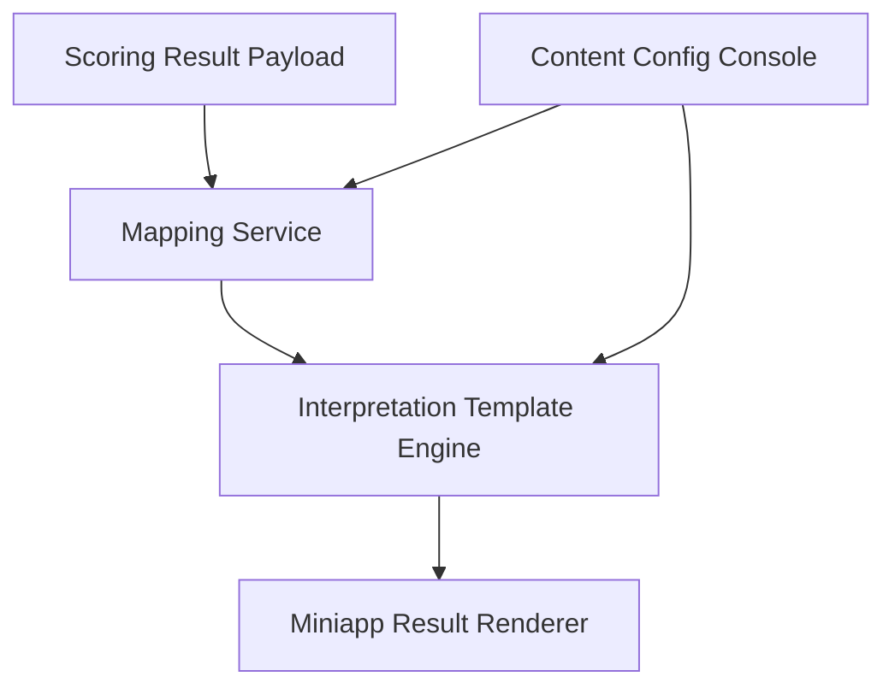

## §0 上游引用（Value Frame 摘要）

- 上游 Value：`EPIC E3 = ielts-band-cefr-mapping`
- Phase：MVP
- 目标 KPI：K1、K3、K8
- Epic 一句话：在结果页展示 IELTS band 与 CEFR 对照解释能力
- 约束继承：结果必须对齐 IELTS band；需要增强评分可理解性与信任度；映射口径仍有上游 OQ。

## §1 Epic 定义

- **Epic Name**：IELTS Band and CEFR Mapping
- **Epic Stable ID**：`EPIC-ielts-band-cefr-mapping`
- **Context**：本 Epic 聚焦“分数解释”而不是“分数生成”。它负责把评分结果以用户能理解的方式转译成 IELTS band、CEFR 对照、能力解释和下一步建议，减少用户只看到数字却无法行动的问题。该 Epic 不负责 AI 打分本身，也不负责完整 website 内容体系。
- **Scope In**：band 显示规则、CEFR 对照表、结果解读卡、分维度解释、免责声明与可信度说明。
- **Scope Out**：评分引擎、挑战题组织、website 商品页、长周期学习计划引擎。
- **Personas**：
  - `P1`：雅思备考考生，需要理解当前水平和提分方向。
  - `P2`：内容/产品同学，维护 band 对应解释文本和对照逻辑。

## §2 Feature List

| Feature ID | Name | Description | Value | 预估 Story 数 | T-shirt | 关联 Persona | 主要复杂度驱动 |
|---|---|---|---|---:|:---:|---|---|
| F1 | Band and CEFR Mapping Model | 建立评分结果到 IELTS band 与 CEFR 等级的映射结构、展示规则和版本口径，让用户看到结果时能快速知道自己在哪个能力区间。 | 提升评分结果可理解性和可信度。 | 3–4 | S | P1, P2 | 口径确认、版本管理和边界 band 处理 |
| F2 | Result Interpretation Cards | 将总分与分维度分数转成“你现在处于什么水平、表现偏强/偏弱在哪里、下一步练什么”的结果解读卡片。 | 让结果更可行动，促进用户继续练习或进入 website。 | 4–6 | M | P1 | 解释模板、分数分层文案、个性化拼装 |
| F3 | Trust and Methodology Layer | 在结果页补充评分依据、解释范围和适度免责声明，帮助用户理解 AI 评分的参考性质和使用边界。 | 降低误解与投诉，增强对结果的信任。 | 3–4 | S | P1, P2 | 可信度表述、法律风险边界、内容呈现轻量化 |

## §3 User Journey

| Persona ID | Stage ID | Stage | Action | Touchpoint | Emotion |
|---|---|---|---|---|---|
| P1 | J1 | Entry | 打开评分结果页 | 结果总览卡 | 想先看分数 |
| P1 | J2 | Understand | 查看 IELTS band 与 CEFR 对照 | band/CEFR 对照模块 | 终于知道自己在哪一档 |
| P1 | J3 | Interpret | 阅读分维度解释和提分建议 | 结果解读卡片 | 明白下一步怎么练 |
| P1 | J4 | Decide | 决定继续练习或进入 website 深度学习 | 结果页 CTA | 有明确下一步 |
| P2 | J5 | Maintain | 更新 band 对应解释文案 | 配置后台 | 保持解释口径一致 |

## §4 Business Process Flow

### Happy Path

评分服务返回总分和分维度分数后，解释层按约定口径计算 IELTS band 和对应 CEFR 区间，并生成结果解读卡和建议。用户在结果页先看总分，再查看 band/CEFR 对照，随后阅读分维度解释并决定下一步。

### Unhappy Path 1：映射口径未最终确认

- 触发点：产品尚未确认固定映射口径时需要上线 MVP。
- 关键决策点：采用固定静态版本还是展示“参考对照”。
- 系统边界：映射口径由产品/内容定义，展示层由本系统实现。
- 异常恢复：先展示参考性说明并保留版本标签，后续可替换为正式口径。

### Unhappy Path 2：结果解释缺失或不适配边界分数

- 触发点：某些边界分数无对应解释文本。
- 关键决策点：是否回退到通用解释模板。
- 系统边界：文案配置在本系统内容层。
- 异常恢复：使用通用解释模板，避免出现空白说明。

## §5 GWT Top 3–5

| Scenario ID | Type | Persona | Name | 关联 Stage | 关联 Feature |
|---|---|---|---|---|---|
| S1 | happy | P1 | 查看 IELTS band 与 CEFR 对照 | J1, J2 | F1 |
| S2 | happy | P1 | 查看分维度解释与建议 | J2, J3 | F2 |
| S3 | unhappy | P1 | 边界分数回退到通用解释 | J3 | F2, F3 |
| S4 | edge | P2 | 映射版本切换后解释生效 | J5 | F1, F3 |

### S1：查看 IELTS band 与 CEFR 对照

GIVEN 用户已完成一次口语评分
AND 系统已返回可展示的分数结果
WHEN 用户打开评分结果页
THEN 页面显示当前 IELTS band
AND 同步展示对应的 CEFR 参考区间
AND 用户可以看到该对照为参考解释而不是考试官方成绩单

### S2：查看分维度解释与建议

GIVEN 结果页已展示总分和分维度分数
WHEN 用户下滑查看结果解释区
THEN 系统展示每个维度的强弱项说明
AND 为用户提供至少一条下一步练习建议

### S3：边界分数回退到通用解释

GIVEN 某次评分结果处于边界分数区间
AND 当前没有精确匹配的解释模板
WHEN 系统生成结果解释
THEN 系统回退到通用等级解释模板
AND 页面不出现空白或技术错误信息

### S4：映射版本切换后解释生效

GIVEN 内容同学已在后台更新映射版本或解释文案
WHEN 新版本发布生效
THEN 后续新生成的结果页使用新版本解释内容
AND 历史结果是否回刷按版本策略执行

## §6 Phase-level Workload（T-shirt 映射）

| Feature | T-shirt | Unit Range | Effort Range | 主要复杂度驱动 |
|---|:---:|---:|---:|---|
| F1 | S | 5–10 units | 2.5–5 days | 映射结构和版本口径 |
| F2 | M | 10–20 units | 5–10 days | 解释模板与动态拼装 |
| F3 | S | 5–10 units | 2.5–5 days | 可信度说明与免责声明 |
| **Epic 合计** | — | **20–40 units** | **10–20 days** | — |

## §7 Tech High-level

### 1. 架构图

### 2. 关键组件清单

| 组件 | 职责 | 归属服务 |
|---|---|---|
| Mapping Service | 将分数转为 band 与 CEFR 对照结构 | Assessment BFF |
| Interpretation Engine | 生成结果解读卡和建议文本 | Content Logic Layer |
| Content Config Console | 配置文案、版本和免责声明 | Ops Admin |
| Result Renderer | 在小程序结果页渲染解释模块 | Miniapp Frontend |

### 3. Service Interaction Flow

- 链路 1：评分服务返回分数 → Mapping Service 生成 band 与 CEFR 对照结果。
- 链路 2：Interpretation Engine 根据分维度分数组装解释和建议文本。
- 链路 3：前端渲染总分、对照表、解释卡和 CTA。
- 链路 4：内容同学更新解释版本 → Config Console 发布 → 新结果页使用新版本。

### 4. 主要 ADR（待研发评审确认）

- ADR-1：band 与 CEFR 对照采用静态配置还是服务端规则计算，当前倾向先静态配置以便快速校正口径。
- ADR-2：解释模板按分数分层还是按多维组合动态生成，当前倾向 MVP 先按分层模板实现，避免文案爆炸。

## §8 Story List 预览

### F1 — Band and CEFR Mapping Model

- `EPIC-ielts-band-cefr-mapping-F1-S01` — band 对照配置：维护 IELTS band 与 CEFR 参考区间映射。
- `EPIC-ielts-band-cefr-mapping-F1-S02` — 结果页对照展示：在结果页展示当前 band 和 CEFR 参考值。

### F2 — Result Interpretation Cards

- `EPIC-ielts-band-cefr-mapping-F2-S01` — 总分解释卡：解释当前整体水平和代表含义。
- `EPIC-ielts-band-cefr-mapping-F2-S02` — 分维度解读：展示强弱项与建议。
- `EPIC-ielts-band-cefr-mapping-F2-S03` — 通用解释回退：边界分数时使用通用模板。

### F3 — Trust and Methodology Layer

- `EPIC-ielts-band-cefr-mapping-F3-S01` — 解释性质说明：提示评分为练习参考。
- `EPIC-ielts-band-cefr-mapping-F3-S02` — 版本信息展示：必要时显示解释版本或更新时间。

## §9 Open Questions（含 Value 继承）

### 来自 Value Frame（继承）

| OQ ID | Question | Status | Owner |
|---|---|---|---|
| V-OQ1 | 小程序首期的挑战机制最小版本是什么：单题挑战、每日挑战、连续打卡，还是榜单竞赛 | open | PM |
| V-OQ2 | 评分结果是否直接展示完整 IELTS band descriptor 解释，还是先展示简化版结论再展开详情 | open | PM |
| V-OQ3 | IELTS band 与 CEFR 对照表采用固定映射还是内部解释版映射 | open | PM + Eng |
| V-OQ4 | website 承接页的首期目标是题库浏览、AI 工具试用，还是直接会员/产品购买转化 | open | PM |
| V-OQ5 | 语音数据的保存周期、授权提示和可复用范围如何定义 | open | PM + Eng |
| V-OQ6 | 小程序评分返回的目标时延能否稳定控制在 20 秒内 | open | Eng |
| V-OQ7 | 首期是否只覆盖指定简化题库，还是同时支持自由题目扩展 | open | PM |

### 本 Solution 新增

| OQ ID | Question | Status | Owner |
|---|---|---|---|
| S-OQ1 | CEFR 对照是否在首版结果页默认展开，还是折叠在“更多说明”中 | open | PM + UX |
| S-OQ2 | 结果解释是否需要中英双语，以支撑更贴近考试语境的展示 | open | PM |

## §10 跨团队评审记录

- 待安排：PM / Eng / Content / Compliance 对 mapping 口径、参考说明和文案风险进行评审。

## §11 已沉淀规则索引

- 评分解释层必须把数字转成用户可理解的 band 与能力说明。
- CEFR 对照必须明确为参考解释，不等同官方成绩证明。
- 缺少精确解释模板时必须回退到通用说明，而不是空白展示。

## §12 变更记录

- 2026-05-08-0100：首版创建，聚焦结果解释、band/CEFR 对照和可信度说明。