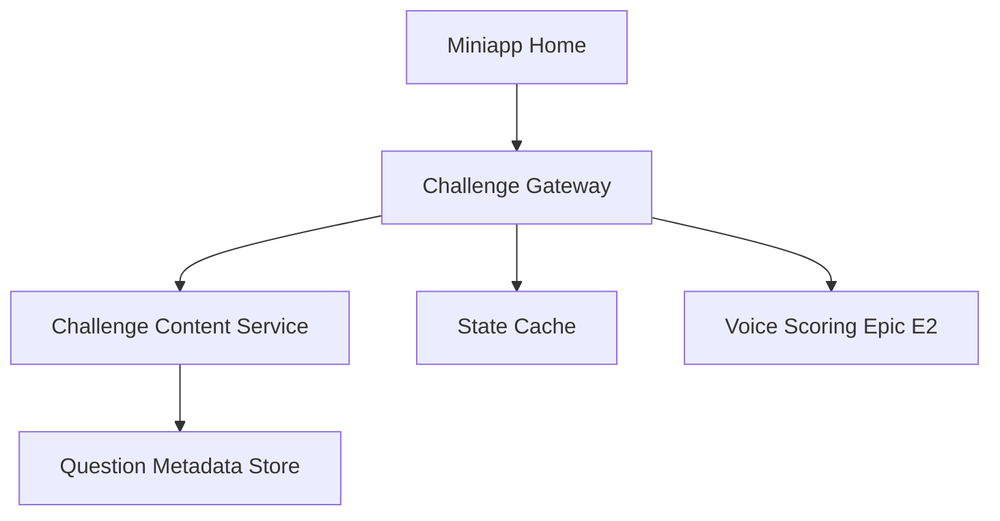

## §0 上游引用（Value Frame 摘要）

- 上游 Value：`EPIC E1 = miniapp-speaking-challenge`
- Phase：MVP
- 目标 KPI：K1、K2、K3、K6、K7
- Epic 一句话：小程序口语挑战入口与题目参与机制
- 约束继承：小程序定位为轻量口语挑战与评分入口；website 承接更完整题库和 AI 能力；首期范围优先口语。

## §1 Epic 定义

- **Epic Name**：Miniapp Speaking Challenge
- **Epic Stable ID**：`EPIC-miniapp-speaking-challenge`
- **Context**：本 Epic 负责在 TOC 小程序内建立“用户愿意开始练”的挑战入口，让考生能够在低门槛、碎片化的移动端场景中进入简化口语题练习。它决定首页如何承接流量、如何组织题目、如何给用户任务感，但不负责 AI 评分引擎本身，也不负责 website 深度承接页的内容建设。
- **Scope In**：挑战首页、题目选择与展示、挑战任务结构、完成态与再练入口、与评分链路的前置衔接。
- **Scope Out**：AI 评分算法、评分维度计算、IELTS band 与 CEFR 映射逻辑、website 落地页内容、完整会员转化体系。
- **Personas**：
  - `P1`：雅思备考考生，使用小程序做高频轻量口语练习。
  - `P2`：增长/运营同学，配置挑战题目、观察参与率与复练表现。

## §2 Feature List

| Feature ID | Name | Description | Value | 预估 Story 数 | T-shirt | 关联 Persona | 主要复杂度驱动 |
|---|---|---|---|---:|:---:|---|---|
| F1 | Challenge Home and Feed | 在小程序首页提供口语挑战入口、今日推荐题和挑战列表，确保用户进入后能在数秒内理解当前可练内容、参与方式和任务目标，而不是先被复杂导航打断。 | 降低首次进入门槛，提升挑战启动率和首页转化率。 | 4–6 | M | P1, P2 | 需要平衡首页轻量入口、题目推荐规则和运营位配置 |
| F2 | Prompt and Participation Flow | 为用户提供清晰的题目卡片、挑战说明、作答前准备提示和开始作答前状态检查，让挑战流程从“选题”自然过渡到“开始回答”。 | 提高开始录音前的理解度和提交前准备充分度，减少中途放弃。 | 3–5 | M | P1 | 涉及题目元数据组织、倒计时提示、状态持久化 |
| F3 | Completion and Replay Loop | 在挑战完成后提供完成态、再练入口、下一个挑战推荐和连续参与提示，把单次作答转成持续行为。 | 提升复练率和 7 日留存，给用户明确的下一步动作。 | 3–4 | S | P1, P2 | 需要和后续评分返回、任务状态、连续挑战逻辑联动 |

## §3 User Journey

| Persona ID | Stage ID | Stage | Action | Touchpoint | Emotion |
|---|---|---|---|---|---|
| P1 | J1 | Entry | 打开小程序并看到口语挑战入口 | 首页挑战卡片 | 很快知道能做什么 |
| P1 | J2 | Browse | 浏览今日挑战和题目说明 | 挑战列表页 | 判断题目是否适合自己 |
| P1 | J3 | Prepare | 查看题目详情与作答提示并开始挑战 | 题目详情页 | 准备开口但略有紧张 |
| P1 | J4 | Result Handoff | 完成挑战后选择查看结果或继续下一题 | 完成态卡片 | 期待反馈并愿意继续 |
| P2 | J5 | Operate | 查看不同挑战入口的参与数据 | 运营配置台/看板 | 判断哪些题目更能带动参与 |

## §4 Business Process Flow

### Happy Path

用户打开小程序首页，看到口语挑战入口和推荐题。用户进入挑战列表，选择一题查看题目说明、作答规则和预计耗时。系统完成基础状态检查后，将用户导向录音作答页。作答完成后，系统返回完成态并引导用户查看评分或继续下一题。

### Unhappy Path 1：无可用挑战题

- 触发点：用户进入挑战列表时，当日无可用题目或题目未发布。
- 关键决策点：是否有备用题、是否允许展示历史题。
- 系统边界：题目发布与推荐规则属于本系统。
- 异常恢复：展示备用推荐或提示稍后再试，并提供历史练习入口。

### Unhappy Path 2：挑战中断后返回

- 触发点：用户在详情页或作答前离开页面，再次进入。
- 关键决策点：是否恢复上次已选题目和准备状态。
- 系统边界：本系统负责本地状态恢复，不负责评分结果恢复。
- 异常恢复：展示“继续当前挑战”或“重新选择题目”两个入口。

## §5 GWT Top 3–5

| Scenario ID | Type | Persona | Name | 关联 Stage | 关联 Feature |
|---|---|---|---|---|---|
| S1 | happy | P1 | 首页进入并开始挑战 | J1, J2, J3 | F1, F2 |
| S2 | unhappy | P1 | 当日无挑战题时的替代路径 | J2 | F1 |
| S3 | edge | P1 | 挑战中断后恢复选择状态 | J3, J4 | F2, F3 |
| S4 | unhappy | P2 | 题目未发布导致入口降级 | J5 | F1 |

### S1：首页进入并开始挑战

GIVEN 用户已进入 TOC 小程序首页
AND 首页存在已发布的口语挑战卡片
WHEN 用户点击某个挑战入口
AND 在挑战列表中选择一题进入详情
THEN 系统展示题目说明、预计耗时和开始挑战按钮
AND 用户可进入录音作答页继续后续评分链路

### S2：当日无挑战题时的替代路径

GIVEN 用户进入挑战列表页
AND 当前日期下没有已发布的挑战题
WHEN 系统加载列表数据
THEN 页面显示“今日挑战即将更新”提示
AND 系统展示至少一个历史题或备用练习入口
AND 用户不会进入空白死路页面

### S3：挑战中断后恢复选择状态

GIVEN 用户已在题目详情页选择某个挑战题
AND 尚未正式提交录音作答
WHEN 用户中途离开页面并在短时间内返回
THEN 系统展示“继续当前挑战”入口
AND 保留上次已选题目的上下文信息
AND 用户也可以选择重新开始或切换题目

### S4：题目未发布导致入口降级

GIVEN 运营同学尚未发布当日挑战题
WHEN 首页请求挑战入口数据
THEN 系统使用默认文案和备用入口降级展示
AND 不向用户暴露配置错误信息
AND 运营看板记录一次题目缺失告警

## §6 Phase-level Workload（T-shirt 映射）

| Feature | T-shirt | Unit Range | Effort Range | 主要复杂度驱动 |
|---|:---:|---:|---:|---|
| F1 | M | 10–20 units | 5–10 days | 首页入口与挑战推荐逻辑 |
| F2 | M | 10–20 units | 5–10 days | 题目元数据、准备态和作答前检查 |
| F3 | S | 5–10 units | 2.5–5 days | 完成态、再练入口与状态联动 |
| **Epic 合计** | — | **25–50 units** | **12.5–25 days** | — |

## §7 Tech High-level

### 1. 架构图

### 2. 关键组件清单

| 组件 | 职责 | 归属服务 |
|---|---|---|
| Challenge Gateway | 聚合首页挑战入口与列表数据 | Miniapp BFF |
| Challenge Content Service | 返回挑战题、说明、状态与推荐位 | Content Service |
| State Cache | 暂存用户当前挑战选择状态 | Miniapp Session Layer |
| Ops Config Console | 配置题目发布、排序与运营位 | Ops Admin |

### 3. Service Interaction Flow

- 链路 1：用户打开首页 → Miniapp BFF → 挑战内容服务 → 返回挑战入口与推荐题。
- 链路 2：用户进入题目详情 → 挑战内容服务 → 读取题目元数据与挑战说明。
- 链路 3：用户点击开始挑战 → Session Layer 写入当前挑战上下文 → 跳转 E2 录音作答链路。
- 链路 4：运营发布题目 → Ops Admin → Challenge Content Service → 更新首页入口与列表展示。

### 4. 主要 ADR（待研发评审确认）

- ADR-1：挑战推荐是否按固定运营排序还是按用户历史动态排序，当前倾向先做固定运营排序以降低 MVP 复杂度。
- ADR-2：中断恢复状态放本地缓存还是服务端会话，当前倾向服务端会话以便跨设备和埋点一致性。

## §8 Story List 预览

### F1 — Challenge Home and Feed

- `EPIC-miniapp-speaking-challenge-F1-S01` — 首页挑战卡片曝光：在首页展示今日挑战和入口文案。
- `EPIC-miniapp-speaking-challenge-F1-S02` — 挑战列表浏览：用户进入列表后可查看已发布挑战题。
- `EPIC-miniapp-speaking-challenge-F1-S03` — 备用入口降级：无题时仍提供历史题或备用练习入口。

### F2 — Prompt and Participation Flow

- `EPIC-miniapp-speaking-challenge-F2-S01` — 题目详情展示：展示题目说明、作答规则和预计耗时。
- `EPIC-miniapp-speaking-challenge-F2-S02` — 开始挑战前状态检查：确认可进入录音作答链路。
- `EPIC-miniapp-speaking-challenge-F2-S03` — 中断后恢复选择：保留已选题目并支持继续挑战。

### F3 — Completion and Replay Loop

- `EPIC-miniapp-speaking-challenge-F3-S01` — 完成态展示：作答后给出完成提示和结果入口。
- `EPIC-miniapp-speaking-challenge-F3-S02` — 下一题推荐：完成后展示后续挑战建议。

## §9 Open Questions（含 Value 继承）

### 来自 Value Frame（继承）

| OQ ID | Question | Status | Owner |
|---|---|---|---|
| V-OQ1 | 小程序首期的挑战机制最小版本是什么：单题挑战、每日挑战、连续打卡，还是榜单竞赛 | open | PM |
| V-OQ2 | 评分结果是否直接展示完整 IELTS band descriptor 解释，还是先展示简化版结论再展开详情 | open | PM |
| V-OQ3 | IELTS band 与 CEFR 对照表采用固定映射还是内部解释版映射 | open | PM + Eng |
| V-OQ4 | website 承接页的首期目标是题库浏览、AI 工具试用，还是直接会员/产品购买转化 | open | PM |
| V-OQ5 | 语音数据的保存周期、授权提示和可复用范围如何定义 | open | PM + Eng |
| V-OQ6 | 小程序评分返回的目标时延能否稳定控制在 20 秒内 | open | Eng |
| V-OQ7 | 首期是否只覆盖指定简化题库，还是同时支持自由题目扩展 | open | PM |

### 本 Solution 新增

| OQ ID | Question | Status | Owner |
|---|---|---|---|
| S-OQ1 | 挑战首页是否需要区分新手与回访用户展示不同入口密度 | open | PM |
| S-OQ2 | 历史题作为备用入口时，是否需要单独标记“非当季挑战” | open | PM + UX |

## §10 跨团队评审记录

- 待安排：PM / Eng / QA / Growth 对挑战入口、状态恢复和运营位规则进行评审。

## §11 已沉淀规则索引

- 小程序首页必须优先给出轻量挑战入口，而不是复杂目录导航。
- 挑战入口缺题时必须降级展示备用练习路径，避免空白页。
- 完成态必须提供明确下一步，而不是只停留在“已完成”。

## §12 变更记录

- 2026-05-08-0100：首版创建，基于 Value E1 展开挑战入口、参与流程与复练闭环。