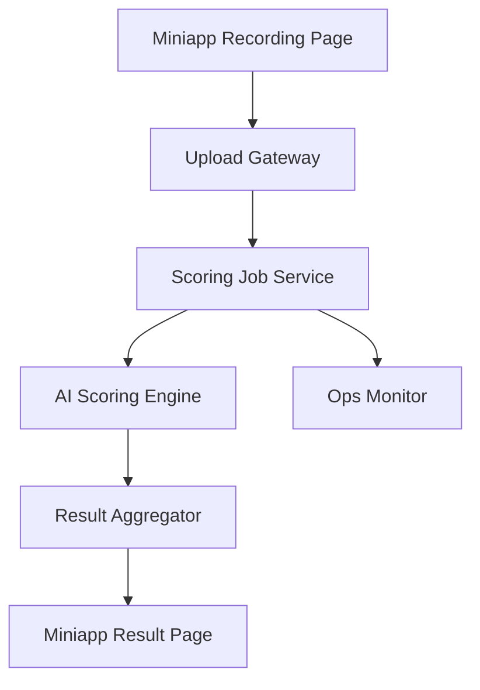

## §0 上游引用（Value Frame 摘要）

- 上游 Value：`EPIC E2 = miniapp-voice-scoring`
- Phase：MVP
- 目标 KPI：K1、K2、K6、K7
- Epic 一句话：录音提交、AI 评分与结果页展示
- 约束继承：结果对齐 IELTS band；小程序负责轻量评分反馈；首期需控制返回时延和失败率。

## §1 Epic 定义

- **Epic Name**：Miniapp Voice Scoring
- **Epic Stable ID**：`EPIC-miniapp-voice-scoring`
- **Context**：本 Epic 承接用户从挑战题进入作答后的关键链路，包括录音采集、提交、评分编排、结果基本展示和异常处理。它是用户感知 AI 测评价值的第一核心环节，直接影响首次完成率、评分可信度和后续复练意愿。该 Epic 不负责挑战题编排，也不负责 website 导流落地页。
- **Scope In**：录音权限检查、录音控件、提交与重录、评分任务创建、结果返回与失败兜底、基础结果展示。
- **Scope Out**：挑战首页、深度 CEFR 映射内容、website 导流页、长期数据运营平台。
- **Personas**：
  - `P1`：雅思备考考生，提交录音并查看评分结果。
  - `P2`：评分服务运营/技术支持，观察任务状态和异常率。

## §2 Feature List

| Feature ID | Name | Description | Value | 预估 Story 数 | T-shirt | 关联 Persona | 主要复杂度驱动 |
|---|---|---|---|---:|:---:|---|---|
| F1 | Recording Capture Controls | 提供稳定的录音权限提示、开始/停止/重录控制和最小输入校验，让用户在移动端能顺畅完成一次可评分的口语提交，而不是因权限或控件不清而流失。 | 降低录音开始失败率，提升用户完成一次有效作答的概率。 | 4–6 | M | P1 | 设备权限、音频质量校验、前端兼容性 |
| F2 | Scoring Orchestration Pipeline | 将用户录音提交到评分任务链路，完成任务创建、排队、状态查询和超时兜底，确保评分结果能在目标时限内返回。 | 直接支撑评分成功率和结果返回时效。 | 4–6 | L | P1, P2 | 异步任务编排、超时控制、状态一致性 |
| F3 | Result Card and Failure Recovery | 以轻量但可信的方式展示总分、分维度评分和基础建议，并在失败时提供明确重试和恢复路径。 | 提升用户对结果的理解度和系统可靠性感知。 | 3–5 | M | P1, P2 | 结果结构定义、异常态分流、文案与状态机 |

## §3 User Journey

| Persona ID | Stage ID | Stage | Action | Touchpoint | Emotion |
|---|---|---|---|---|---|
| P1 | J1 | Entry | 进入录音作答页并授权麦克风 | 录音作答页 | 希望马上开始 |
| P1 | J2 | Action | 开始录音、结束录音并确认提交 | 录音控件区 | 紧张但专注 |
| P1 | J3 | Decision | 等待评分结果并决定是否重试 | 评分处理中页 | 关心速度和稳定性 |
| P1 | J4 | Result | 查看总分、分维度分数和建议 | 评分结果页 | 想知道自己哪里不足 |
| P2 | J5 | Support | 查看异常任务和失败原因 | 评分任务监控台 | 需要快速定位问题 |

## §4 Business Process Flow

### Happy Path

用户在录音页授权麦克风后开始作答，完成后点击提交。系统创建评分任务，将音频发送到评分服务，轮询或回调获取结果，并在 20 秒目标时限内返回总分、分维度分数和基础建议。用户查看结果后可选择再次作答或返回下一题。

### Unhappy Path 1：麦克风权限被拒绝

- 触发点：用户首次进入录音页时拒绝授权。
- 关键决策点：是否允许重试授权或转到帮助说明。
- 系统边界：权限申请由客户端控制，提示逻辑由本系统控制。
- 异常恢复：提供重新授权入口和权限说明，不允许直接提交空录音。

### Unhappy Path 2：评分超时或失败

- 触发点：评分任务超过目标时限或服务返回失败。
- 关键决策点：展示处理中继续等待、立即失败还是允许稍后查看。
- 系统边界：评分服务为外部/独立服务，结果页由本系统控制。
- 异常恢复：展示明确失败态，支持重新提交或稍后刷新结果。

## §5 GWT Top 3–5

| Scenario ID | Type | Persona | Name | 关联 Stage | 关联 Feature |
|---|---|---|---|---|---|
| S1 | happy | P1 | 完成录音并拿到评分结果 | J1, J2, J3, J4 | F1, F2, F3 |
| S2 | failure | P1 | 麦克风权限被拒绝 | J1 | F1 |
| S3 | unhappy | P1 | 评分超时后的重试路径 | J3, J4 | F2, F3 |
| S4 | edge | P2 | 异常任务进入监控台 | J5 | F2, F3 |

### S1：完成录音并拿到评分结果

GIVEN 用户已从挑战题进入录音作答页
AND 麦克风权限已授权
WHEN 用户完成录音并点击提交
AND 评分服务在目标时限内返回结果
THEN 系统展示总分、分维度分数和基础建议
AND 用户可选择再次作答或返回下一步入口

### S2：麦克风权限被拒绝

GIVEN 用户首次进入录音作答页
AND 系统发起麦克风权限请求
WHEN 用户拒绝授权
THEN 系统展示权限说明和重新授权入口
AND 不允许用户继续录音提交
AND 页面保留返回挑战页的路径

### S3：评分超时后的重试路径

GIVEN 用户已成功提交一段有效录音
AND 系统已创建评分任务
WHEN 评分结果在目标时限内未返回
THEN 系统展示“结果生成较慢”状态
AND 提供继续等待、刷新结果或重新提交三种动作
AND 不让用户误以为提交丢失

### S4：异常任务进入监控台

GIVEN 某次评分任务返回失败状态
WHEN 系统写入异常日志
THEN 监控台展示任务 ID、失败原因和发生时间
AND 支持技术同学按失败类型筛查问题

## §6 Phase-level Workload（T-shirt 映射）

| Feature | T-shirt | Unit Range | Effort Range | 主要复杂度驱动 |
|---|:---:|---:|---:|---|
| F1 | M | 10–20 units | 5–10 days | 录音权限与音频输入控件 |
| F2 | L | 20–40 units | 10–20 days | 异步评分任务编排与超时处理 |
| F3 | M | 10–20 units | 5–10 days | 结果页状态机与失败恢复 |
| **Epic 合计** | — | **40–80 units** | **20–40 days** | — |

## §7 Tech High-level

### 1. 架构图

### 2. 关键组件清单

| 组件 | 职责 | 归属服务 |
|---|---|---|
| Recording UI | 采集音频、控制开始停止和重录 | Miniapp Frontend |
| Upload Gateway | 接收音频、做基本校验和任务创建 | API Gateway |
| Scoring Job Service | 编排评分任务、维护状态机 | Scoring Orchestrator |
| AI Scoring Engine | 生成分数与建议 | AI Assessment Service |
| Result Aggregator | 标准化结果结构返回前端 | Assessment BFF |

### 3. Service Interaction Flow

- 链路 1：用户开始录音 → 前端采集音频 → 本地校验时长和文件完整性。
- 链路 2：用户提交录音 → Upload Gateway → Scoring Job Service → AI Scoring Engine。
- 链路 3：评分完成 → Result Aggregator 组装总分、分维度分数和建议 → 返回结果页。
- 链路 4：评分失败/超时 → Scoring Job Service 写入监控台 → 前端展示失败态和重试入口。

### 4. 主要 ADR（待研发评审确认）

- ADR-1：评分结果采用轮询还是回调推送，当前倾向 MVP 使用短轮询以降低小程序接入复杂度。
- ADR-2：录音文件先落对象存储还是直接流式传给评分服务，当前倾向先落存储以支持失败排查和可控重试。

## §8 Story List 预览

### F1 — Recording Capture Controls

- `EPIC-miniapp-voice-scoring-F1-S01` — 麦克风权限申请：首次进入录音页时发起权限检查与说明。
- `EPIC-miniapp-voice-scoring-F1-S02` — 录音开始停止控件：支持开始、停止和重录操作。
- `EPIC-miniapp-voice-scoring-F1-S03` — 无效录音校验：空录音或过短录音不可提交。

### F2 — Scoring Orchestration Pipeline

- `EPIC-miniapp-voice-scoring-F2-S01` — 音频提交创建任务：提交后创建评分任务并返回处理中状态。
- `EPIC-miniapp-voice-scoring-F2-S02` — 评分状态查询：前端可查询任务状态直到完成或失败。
- `EPIC-miniapp-voice-scoring-F2-S03` — 超时与失败处理：任务超时或失败时进入兜底路径。

### F3 — Result Card and Failure Recovery

- `EPIC-miniapp-voice-scoring-F3-S01` — 评分结果卡片：展示总分、分维度分数和基础建议。
- `EPIC-miniapp-voice-scoring-F3-S02` — 失败态重试：评分失败时提供重试与返回路径。

## §9 Open Questions（含 Value 继承）

### 来自 Value Frame（继承）

| OQ ID | Question | Status | Owner |
|---|---|---|---|
| V-OQ1 | 小程序首期的挑战机制最小版本是什么：单题挑战、每日挑战、连续打卡，还是榜单竞赛 | open | PM |
| V-OQ2 | 评分结果是否直接展示完整 IELTS band descriptor 解释，还是先展示简化版结论再展开详情 | open | PM |
| V-OQ3 | IELTS band 与 CEFR 对照表采用固定映射还是内部解释版映射 | open | PM + Eng |
| V-OQ4 | website 承接页的首期目标是题库浏览、AI 工具试用，还是直接会员/产品购买转化 | open | PM |
| V-OQ5 | 语音数据的保存周期、授权提示和可复用范围如何定义 | open | PM + Eng |
| V-OQ6 | 小程序评分返回的目标时延能否稳定控制在 20 秒内 | open | Eng |
| V-OQ7 | 首期是否只覆盖指定简化题库，还是同时支持自由题目扩展 | open | PM |

### 本 Solution 新增

| OQ ID | Question | Status | Owner |
|---|---|---|---|
| S-OQ1 | 首期是否允许用户在评分返回前离开页面并稍后查看结果 | open | PM + Eng |
| S-OQ2 | 音频存储是否需要做脱敏或分级保留策略 | open | Eng + Compliance |

## §10 跨团队评审记录

- 待安排：PM / Eng / QA / Compliance 对录音权限、音频存储和评分超时策略进行评审。

## §11 已沉淀规则索引

- 录音页必须先解决授权与输入有效性，再进入评分链路。
- 评分超时和失败必须有清晰可恢复路径，不能只给通用报错。
- 结果页首版至少展示总分、分维度分数和基础建议。

## §12 变更记录

- 2026-05-08-0100：首版创建，聚焦录音采集、评分编排与结果页基础状态机。