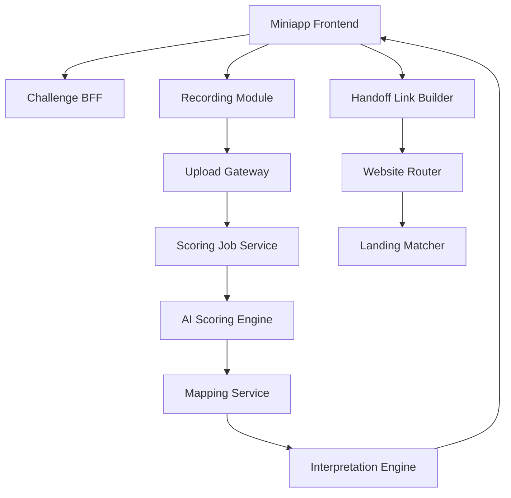

## §0 上游引用（Value Frame 摘要）

- 上游 Value：`EPIC E1 = speaking-challenge-and-scoring`
- Phase：MVP
- 目标 KPI：K1、K2、K3、K6、K7
- value_statement：用户能在小程序内完成一次口语作答并立刻拿到对齐 IELTS band 与 CEFR 的评分，并被引导到 website 进一步提分。
- 约束继承：小程序为轻量入口；website 承接更全题库与 AI 能力；评分对齐 IELTS band 并提供 CEFR 对照；首期范围优先口语。
- 合并说明：本 brief 替代旧 E1-E4 四份独立 brief，按 SKILL v1.1.0 Epic 颗粒度规则合并为一个端到端价值单元。

## §1 Epic 定义

- **Epic Name**：Speaking Challenge and Scoring
- **Epic Stable ID**：`EPIC-speaking-challenge-and-scoring`
- **Context**：本 Epic 是 MVP 阶段的核心价值单元，覆盖从“用户在小程序进入挑战题”到“拿到对齐 IELTS band 与 CEFR 的评分结果”再到“被引导到 website 获取深度工具”的完整闭环。它是用户第一次完整感知本产品价值的链路，任何子能力单独上线都不构成可交付价值，因此整体作为单一 Epic 推进。
- **Scope In**：挑战入口与题目参与、录音采集与提交、评分编排与异常兜底、IELTS band 与 CEFR 对照解释、结果页 CTA 与 website 深链导流、归因埋点。
- **Scope Out**：连续挑战与回访留存（属 E2）、更细粒度提分建议（属 E3）、website 内题库/AI 工具/付费承接细节（属 E4）、长期数据运营平台（属 E5）。
- **Personas**：
  - `P1`：雅思备考考生，进入挑战、提交录音、查看评分并决定下一步。
  - `P2`：评分与运营技术同学，监控评分链路异常和导流转化。
  - `P3`：内容/增长同学，维护题目、band/CEFR 解释口径与导流文案。

## §2 Feature List

| Feature ID | Name | Description | Value | 预估 Story 数 | T-shirt | 关联 Persona | 主要复杂度驱动 |
|---|---|---|---|---:|:---:|---|---|
| F1 | Challenge Participation Flow | 在小程序首页和挑战列表提供轻量挑战入口、题目说明、作答前准备和中断恢复，让用户能在数秒内进入到录音作答的前一步。 | 降低首次参与门槛，提升挑战启动率与首次作答完成率。 | 4–6 | M | P1, P3 | 入口推荐规则、状态恢复与运营位配置 |
| F2 | Voice Scoring Pipeline | 提供录音权限、录音控件、提交校验、评分任务编排、结果聚合和失败兜底，确保评分能在目标时限内返回结构化结果。 | 直接支撑 K1 / K2 / K6 / K7，是用户感知 AI 测评的核心环节。 | 5–7 | L | P1, P2 | 异步任务编排、超时控制、状态一致性与音频质量校验 |
| F3 | Band-and-CEFR Result Card | 将评分结果转译成 IELTS band、CEFR 对照、分维度解读和基础下一步建议，让用户能理解结果并知道接下来该做什么。 | 提升结果可理解性与信任度，支撑后续复练和导流。 | 4–6 | M | P1, P3 | 映射口径管理、解释模板拼装、边界分数兜底与可信度表述 |
| F4 | Website Handoff CTA | 在结果页按用户分数和场景展示合适的 website 入口，透传来源与分层参数，让用户从轻量评分自然过渡到深度工具。 | 提升 K3 导流点击率，为 K5 付费转化提供高意向流量。 | 3–5 | M | P1, P3 | 跨端深链协议、归因埋点、低分用户内容优先承接 |

## §3 User Journey

| Persona ID | Stage ID | Stage | Action | Touchpoint | Emotion |
|---|---|---|---|---|---|
| P1 | J1 | Entry | 打开小程序看到口语挑战入口 | 首页挑战卡片 | 很快知道能做什么 |
| P1 | J2 | Prepare | 进入题目详情、查看说明并开始挑战 | 题目详情页 | 有目标但略紧张 |
| P1 | J3 | Action | 授权麦克风、完成录音并提交 | 录音作答页 | 专注投入 |
| P1 | J4 | Wait | 等待评分返回 | 评分处理中页 | 关心是否稳定 |
| P1 | J5 | Result | 查看总分、IELTS band、CEFR 对照与分维度解读 | 评分结果页 | 终于知道自己处于哪一档 |
| P1 | J6 | Decision | 选择继续练习或进入 website 深度工具 | 结果页 CTA 区 | 判断下一步该往哪走 |
| P2 | J7 | Support | 监控评分异常与导流转化 | 评分监控台 / 增长看板 | 需要快速定位问题 |

## §4 Business Process Flow

### Happy Path

用户从首页挑战入口进入题目详情，授权麦克风并完成录音提交。系统创建评分任务，AI 评分服务返回结构化结果，解释层将结果映射为 IELTS band 与 CEFR 对照，结果页同时展示总分、分维度解读与下一步建议。用户可选择继续下一题，或点击导流入口跳转 website。

### Unhappy Path 1：麦克风权限被拒绝

- 触发点：用户首次进入录音页拒绝授权。
- 关键决策点：是否引导重新授权或返回挑战页。
- 系统边界：权限申请由客户端控制，引导文案由本系统控制。
- 异常恢复：展示权限说明与重新授权入口，禁止提交空录音。

### Unhappy Path 2：评分超时或失败

- 触发点：评分任务超过目标时限或服务返回失败。
- 关键决策点：让用户继续等待、立即失败还是稍后查看。
- 系统边界：评分服务为独立服务，结果页由本系统控制。
- 异常恢复：展示明确失败态，支持重新提交或刷新结果。

### Unhappy Path 3：边界分数缺解释或映射口径未确认

- 触发点：评分结果落在边界 band，或 CEFR 映射口径尚未最终确认。
- 关键决策点：使用通用解释模板还是隐藏对照模块。
- 系统边界：解释口径由内容/产品定义，展示由本系统实现。
- 异常恢复：回退到通用解释模板，并明确标注“参考解释，非官方成绩”。

### Unhappy Path 4：导流参数缺失

- 触发点：从结果页跳转 website 时部分透传参数丢失。
- 关键决策点：是否降级到默认承接页。
- 系统边界：小程序负责发参，website 负责收参与降级。
- 异常恢复：进入默认承接页并记录归因缺失埋点，不出现 404 或空白页。

## §5 GWT Top 3–5

| Scenario ID | Type | Persona | Name | 关联 Stage | 关联 Feature |
|---|---|---|---|---|---|
| S1 | happy | P1 | 端到端完成挑战并拿到 band/CEFR 评分 | J1, J2, J3, J4, J5 | F1, F2, F3 |
| S2 | failure | P1 | 麦克风权限被拒绝时的引导路径 | J3 | F2 |
| S3 | unhappy | P1 | 评分超时后的重试与等待路径 | J4, J5 | F2, F3 |
| S4 | unhappy | P1 | 边界分数回退到通用解释 | J5 | F3 |
| S5 | happy | P1 | 结果页点击导流并进入匹配承接页 | J5, J6 | F3, F4 |

### S1：端到端完成挑战并拿到 band/CEFR 评分

GIVEN 用户已进入小程序首页
AND 当前存在已发布的口语挑战题
AND 用户已授权麦克风权限
WHEN 用户从首页挑战卡片进入题目详情并完成录音提交
AND 评分服务在目标时限内返回结构化结果
THEN 结果页展示总分、IELTS band、CEFR 参考区间和分维度解读
AND 用户可选择继续练习或进入下一步入口

### S2：麦克风权限被拒绝时的引导路径

GIVEN 用户首次进入录音作答页
AND 系统已发起麦克风权限请求
WHEN 用户拒绝授权
THEN 系统展示权限说明和重新授权入口
AND 禁止用户继续录音提交
AND 页面保留返回挑战列表的路径

### S3：评分超时后的重试与等待路径

GIVEN 用户已成功提交一段有效录音
AND 系统已创建评分任务
WHEN 评分结果在目标时限内未返回
THEN 系统展示“结果生成较慢”状态
AND 提供继续等待、刷新结果或重新提交三种动作
AND 不让用户误以为提交丢失

### S4：边界分数回退到通用解释

GIVEN 评分结果落在某个边界 band 区间
AND 当前缺少精确匹配的解释模板
WHEN 系统生成结果解释
THEN 系统使用通用等级解释模板填充
AND 标注当前解释为参考性说明而非官方成绩
AND 页面不出现空白或技术错误信息

### S5：结果页点击导流并进入匹配承接页

GIVEN 用户已查看完一次评分结果
AND 结果页存在与当前分层匹配的导流入口
WHEN 用户点击该入口
THEN 系统将来源场景与分层参数透传到 website
AND website 展示与当前分数和场景匹配的承接模块
AND 系统记录一次完整的导流归因事件

## §6 Phase-level Workload（T-shirt 映射）

| Feature | T-shirt | Unit Range | Effort Range | 主要复杂度驱动 |
|---|:---:|---:|---:|---|
| F1 | M | 10–20 units | 5–10 days | 入口推荐与中断恢复 |
| F2 | L | 20–40 units | 10–20 days | 异步评分编排与超时处理 |
| F3 | M | 10–20 units | 5–10 days | band/CEFR 映射与解释拼装 |
| F4 | M | 10–20 units | 5–10 days | 跨端深链与归因匹配 |
| **Epic 合计** | — | **50–100 units** | **25–50 days** | — |

## §7 Tech High-level

### 1. 架构图

### 2. 关键组件清单

| 组件 | 职责 | 归属服务 |
|---|---|---|
| Challenge BFF | 聚合挑战入口、题目元数据与状态 | Miniapp BFF |
| Recording Module | 麦克风权限、录音控件与本地校验 | Miniapp Frontend |
| Upload Gateway | 接收音频、基本校验与任务创建 | API Gateway |
| Scoring Job Service | 评分任务编排、状态机与超时兜底 | Scoring Orchestrator |
| AI Scoring Engine | 生成分数与维度评分 | AI Assessment Service |
| Mapping Service | IELTS band 与 CEFR 对照映射 | Assessment BFF |
| Interpretation Engine | 生成结果解读卡与基础建议 | Content Logic Layer |
| Handoff Link Builder | 构建带分层参数的 website 深链 | Shared Growth Service |
| Website Router + Landing Matcher | 接收参数并匹配承接模块 | Website BFF / Growth Layer |
| Attribution Tracker | 记录点击、到达与转化事件 | Data / Analytics |

### 3. Service Interaction Flow

- 链路 1：用户进入挑战 → Challenge BFF 返回入口与题目 → Recording Module 准备作答。
- 链路 2：提交录音 → Upload Gateway → Scoring Job Service → AI Scoring Engine → 返回评分。
- 链路 3：Mapping Service 将分数转为 band 与 CEFR → Interpretation Engine 生成解读卡 → 前端渲染结果页。
- 链路 4：用户点击导流入口 → Handoff Link Builder 透传分层参数 → Website Router 路由到 Landing Matcher → 命中匹配承接页。
- 链路 5：异常评分任务或归因事件 → Attribution Tracker / 监控台 供运营与技术复盘。

### 4. 主要 ADR（待研发评审确认）

- ADR-1：评分结果采用轮询还是回调推送，MVP 倾向短轮询以降低小程序接入复杂度。
- ADR-2：录音文件先落对象存储还是直接流式给评分服务，倾向先落存储以便失败排查与可控重试。
- ADR-3：band 与 CEFR 对照采用静态配置还是服务端规则计算，倾向 MVP 静态配置以便快速校正口径。
- ADR-4：深链是否包含具体分数还是只传分层区间，倾向只传分层区间以减少敏感信息扩散。

## §8 Story List 预览

### F1 — Challenge Participation Flow

- `EPIC-speaking-challenge-and-scoring-F1-S01` — 首页挑战卡片曝光：在首页展示今日挑战与入口文案。
- `EPIC-speaking-challenge-and-scoring-F1-S02` — 挑战列表浏览：用户进入列表查看已发布挑战题。
- `EPIC-speaking-challenge-and-scoring-F1-S03` — 题目详情与开始挑战：展示说明并进入录音页。
- `EPIC-speaking-challenge-and-scoring-F1-S04` — 中断恢复：保留已选题目并支持继续挑战。
- `EPIC-speaking-challenge-and-scoring-F1-S05` — 题目缺失降级：无题时提供历史题或备用入口。

### F2 — Voice Scoring Pipeline

- `EPIC-speaking-challenge-and-scoring-F2-S01` — 麦克风权限申请：首次进入录音页发起授权与说明。
- `EPIC-speaking-challenge-and-scoring-F2-S02` — 录音控件：支持开始、停止与重录。
- `EPIC-speaking-challenge-and-scoring-F2-S03` — 无效录音校验：空或过短录音不可提交。
- `EPIC-speaking-challenge-and-scoring-F2-S04` — 音频提交与任务创建：提交后返回处理中状态。
- `EPIC-speaking-challenge-and-scoring-F2-S05` — 评分状态查询：前端可查询任务状态。
- `EPIC-speaking-challenge-and-scoring-F2-S06` — 超时与失败处理：进入兜底路径并支持重试。

### F3 — Band-and-CEFR Result Card

- `EPIC-speaking-challenge-and-scoring-F3-S01` — 总分与分维度展示：结果页基础卡片。
- `EPIC-speaking-challenge-and-scoring-F3-S02` — IELTS band 与 CEFR 对照：展示当前 band 与 CEFR 参考。
- `EPIC-speaking-challenge-and-scoring-F3-S03` — 分维度解读卡：解释强弱项并给出基础建议。
- `EPIC-speaking-challenge-and-scoring-F3-S04` — 边界分数通用解释回退：缺模板时使用通用文案。
- `EPIC-speaking-challenge-and-scoring-F3-S05` — 解释性质说明：明确为练习参考而非官方成绩。

### F4 — Website Handoff CTA

- `EPIC-speaking-challenge-and-scoring-F4-S01` — 结果页 CTA 渲染：按分层与场景展示导流入口。
- `EPIC-speaking-challenge-and-scoring-F4-S02` — 深链参数透传：传递来源与分层区间参数。
- `EPIC-speaking-challenge-and-scoring-F4-S03` — 归因埋点：记录点击、到达与后续转化。
- `EPIC-speaking-challenge-and-scoring-F4-S04` — 参数缺失降级：缺参时进入默认承接页。

## §9 Open Questions（含 Value 继承）

### 来自 Value Frame（继承）

| OQ ID | Question | Status | Owner |
|---|---|---|---|
| V-OQ1 | 小程序首期的挑战机制最小版本是什么：单题挑战、每日挑战、连续打卡，还是榜单竞赛 | open | PM |
| V-OQ2 | 评分结果是否直接展示完整 IELTS band descriptor 解释，还是先展示简化版结论再展开详情 | open | PM |
| V-OQ3 | IELTS band 与 CEFR 对照表采用固定映射还是内部解释版映射 | open | PM + Eng |
| V-OQ4 | website 承接页的首期目标是题库浏览、AI 工具试用，还是直接会员/产品购买转化 | open | PM |
| V-OQ5 | 语音数据的保存周期、授权提示和可复用范围如何定义 | open | PM + Eng |
| V-OQ6 | 小程序评分返回的目标时延能否稳定控制在 20 秒内 | open | Eng |
| V-OQ7 | 首期是否只覆盖指定简化题库，还是同时支持自由题目扩展 | open | PM |

### 本 Solution 新增

| OQ ID | Question | Status | Owner |
|---|---|---|---|
| S-OQ1 | 评分返回前是否允许用户离开页面并稍后查看结果 | open | PM + Eng |
| S-OQ2 | 音频存储是否需要做脱敏或分级保留策略 | open | Eng + Compliance |
| S-OQ3 | 小程序到 website 是否需要账号打通后再跳转，还是允许匿名承接 | open | PM + Eng |
| S-OQ4 | 承接页首版是否允许直接出现价格和购买 CTA，还是先用工具试用承接 | open | PM + Growth |
| S-OQ5 | 本 Epic 整体规模偏 L+，是否在第一次研发评审拆分为里程碑迭代 | open | Eng + PM |

## §10 跨团队评审记录

- 待安排：PM / Eng / QA / Compliance / Growth / Content 联合评审，覆盖挑战入口、录音与评分链路、band/CEFR 解释、website 导流与归因。

## §11 已沉淀规则索引

- 端到端价值链路（参与 → 评分 → 解释 → 导流）必须作为单一 Epic 推进，不再按层切。
- 录音页必须先解决授权与输入有效性，再进入评分链路。
- 评分超时与失败必须有清晰可恢复路径。
- band 与 CEFR 对照仅作为参考解释，不等同官方成绩。
- 小程序导流必须延续用户得分语境，不允许裸跳转。

## §12 变更记录

- 2026-05-08-0200：首版创建。本 brief 由旧 E1 miniapp-speaking-challenge / 旧 E2 miniapp-voice-scoring / 旧 E3 ielts-band-cefr-mapping / 旧 E4 website-handoff-entry 四份 brief 合并而成，对应 Value Frame v0000 的 §4 refine（合并为新 E1 speaking-challenge-and-scoring）。旧四份 brief 已退役，详见各 Solution 子目录的 LATEST.md。
