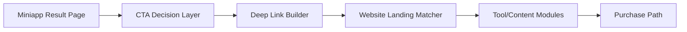
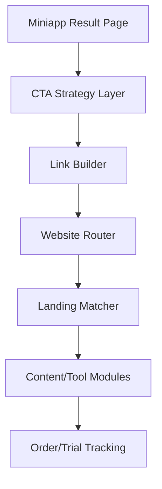

## §0 上游引用（Value Frame 摘要）

- 上游 Value：`EPIC E4 = website-handoff-entry`
- Phase：MVP
- 目标 KPI：K3、K5
- Epic 一句话：从结果页导流到 website AI 工具集合
- 约束继承：website 承接更全题库、更多 AI 能力、解题锦囊、提分建议和付费转化。

## §1 Epic 定义

- **Epic Name**：Website Handoff Entry
- **Epic Stable ID**：`EPIC-website-handoff-entry`
- **Context**：本 Epic 负责把小程序里的“轻量评分体验”转成 website 的“更完整 AI 测评体验和商业化入口”。它不是独立建 website，而是定义从结果页出发的 CTA、深链参数、落地页匹配和归因方式，确保导流不是裸跳转，而是延续用户当前得分与提分诉求。
- **Scope In**：结果页 CTA、导流文案、参数透传、落地页匹配、来源归因、转化埋点。
- **Scope Out**：website 全量题库建设、支付结算本身、会员权益体系细节、长期 CRM 自动化。
- **Personas**：
  - `P1`：完成评分后的考生，希望获取更完整练习和提分方案。
  - `P2`：增长/商业化同学，关注导流质量和付费转化。

## §2 Feature List

| Feature ID | Name | Description | Value | 预估 Story 数 | T-shirt | 关联 Persona | 主要复杂度驱动 |
|---|---|---|---|---:|:---:|---|---|
| F1 | Result Page CTA Strategy | 在小程序结果页按用户当前分数和行为阶段展示合适的 website 入口文案、利益点和触发位置，避免导流过早或过生硬。 | 提升导流点击率，让用户愿意从轻量体验进入深度工具。 | 3–5 | S | P1, P2 | 文案策略、触发时机和页面位置选择 |
| F2 | Deep Link and Attribution | 通过参数透传用户当前挑战、分数区间和来源场景，让 website 能识别用户来自哪种结果页，并还原推荐上下文。 | 提高导流后承接一致性和后续转化分析准确性。 | 4–6 | M | P1, P2 | 跨端参数协议、身份识别和归因埋点 |
| F3 | Matched Landing and Conversion Path | 根据用户来源和得分区间匹配对应的 website 承接页模块，如题库、AI 工具、锦囊和付费 CTA，避免所有用户跳到同一泛页面。 | 提高 website 停留、试用和付费转化。 | 4–6 | M | P1, P2 | 落地页模块组合、内容匹配规则、实验埋点 |

## §3 User Journey

| Persona ID | Stage ID | Stage | Action | Touchpoint | Emotion |
|---|---|---|---|---|---|
| P1 | J1 | Entry | 在结果页看到继续提分入口 | 小程序结果页 CTA 区 | 想知道下一步能做什么 |
| P1 | J2 | Click | 点击导流入口并跳转 website | 小程序外跳确认/深链 | 希望内容和当前分数有关 |
| P1 | J3 | Explore | 浏览匹配的题库、AI 工具和建议模块 | website 落地页 | 感觉承接自然 |
| P1 | J4 | Decision | 试用工具或进入购买流程 | website 工具页/商品页 | 判断值不值得付费 |
| P2 | J5 | Analyze | 查看不同入口和落地页的转化表现 | 增长分析看板 | 优化导流策略 |

## §4 Business Process Flow

### Happy Path

用户在小程序结果页看到与当前分数和状态相匹配的 CTA。点击后系统透传来源、题目和分数区间参数到 website，website 根据参数展示对应承接模块和商品 CTA。用户浏览内容后试用 AI 工具或进入付费路径。

### Unhappy Path 1：导流参数缺失

- 触发点：从结果页跳转时部分参数丢失或身份识别失败。
- 关键决策点：是否降级到默认落地页。
- 系统边界：小程序负责发参，website 负责收参与降级。
- 异常恢复：进入默认落地页，同时记录归因缺失埋点。

### Unhappy Path 2：落地页与用户期待不匹配

- 触发点：用户点击“提分建议”却进入纯商品页。
- 关键决策点：是否优先展示内容模块再展示购买 CTA。
- 系统边界：承接页模块选择由 website 控制。
- 异常恢复：先提供工具/内容价值，再承接购买动作。

## §5 GWT Top 3–5

| Scenario ID | Type | Persona | Name | 关联 Stage | 关联 Feature |
|---|---|---|---|---|---|
| S1 | happy | P1 | 结果页点击后进入匹配承接页 | J1, J2, J3 | F1, F2, F3 |
| S2 | unhappy | P1 | 参数缺失时降级到默认承接页 | J2, J3 | F2, F3 |
| S3 | edge | P1 | 低分用户进入更强内容导向承接页 | J1, J3 | F1, F3 |
| S4 | happy | P2 | 追踪不同 CTA 的导流转化 | J5 | F1, F2 |

### S1：结果页点击后进入匹配承接页

GIVEN 用户已完成一次口语评分
AND 结果页展示“继续提分”入口
WHEN 用户点击该入口
THEN 系统将来源场景和分数区间参数传递到 website
AND website 展示与当前结果相匹配的题库、AI 工具或建议模块

### S2：参数缺失时降级到默认承接页

GIVEN 用户从小程序结果页点击导流入口
AND 跳转过程中未能完整带上透传参数
WHEN website 接收请求
THEN 系统进入默认承接页
AND 保持可浏览题库和 AI 工具入口
AND 记录一次归因缺失事件用于分析

### S3：低分用户进入更强内容导向承接页

GIVEN 用户当前评分处于较低分层
WHEN 用户从结果页点击导流入口
THEN website 优先展示提分建议、学习锦囊和入门工具
AND 不直接把用户送到纯购买页

### S4：追踪不同 CTA 的导流转化

GIVEN 结果页存在多个 CTA 版本或位置实验
WHEN 用户点击任一导流入口
THEN 系统记录 CTA 版本、来源页面和后续转化表现
AND 增长同学可以对比不同策略效果

## §6 Phase-level Workload（T-shirt 映射）

| Feature | T-shirt | Unit Range | Effort Range | 主要复杂度驱动 |
|---|:---:|---:|---:|---|
| F1 | S | 5–10 units | 2.5–5 days | CTA 策略和结果页位置 |
| F2 | M | 10–20 units | 5–10 days | 跨端深链和归因参数协议 |
| F3 | M | 10–20 units | 5–10 days | 承接页模块匹配与实验埋点 |
| **Epic 合计** | — | **25–50 units** | **12.5–25 days** | — |

## §7 Tech High-level

### 1. 架构图

### 2. 关键组件清单

| 组件 | 职责 | 归属服务 |
|---|---|---|
| CTA Strategy Layer | 决定结果页导流入口文案和展示位 | Miniapp Frontend/BFF |
| Link Builder | 构建带来源和分数区间的深链 | Shared Growth Service |
| Website Router | 接收参数并路由到合适承接页 | Website BFF |
| Landing Matcher | 选择题库、AI 工具和 CTA 模块组合 | Website Growth Layer |
| Attribution Tracker | 记录点击、到达、试用和付费事件 | Data/Analytics |

### 3. Service Interaction Flow

- 链路 1：结果页渲染 → CTA Strategy Layer 决定入口文案与位置。
- 链路 2：点击导流 → Link Builder 透传来源、得分区间和挑战信息。
- 链路 3：website 路由 → Landing Matcher 选择承接模块和 CTA。
- 链路 4：用户试用或购买 → Attribution Tracker 归因回写增长看板。

### 4. 主要 ADR（待研发评审确认）

- ADR-1：深链参数是否包含具体分数还是只传分层区间，当前倾向只传分层区间以减少敏感信息扩散。
- ADR-2：承接页用单一动态页还是多静态模版组合，当前倾向单一动态页以便实验和运营迭代。

## §8 Story List 预览

### F1 — Result Page CTA Strategy

- `EPIC-website-handoff-entry-F1-S01` — 结果页 CTA 渲染：根据结果页状态展示合适入口。
- `EPIC-website-handoff-entry-F1-S02` — CTA 版本实验：支持不同文案或位置策略。

### F2 — Deep Link and Attribution

- `EPIC-website-handoff-entry-F2-S01` — 深链参数透传：传递来源场景和结果分层参数。
- `EPIC-website-handoff-entry-F2-S02` — 归因埋点记录：记录点击、到达和转化事件。
- `EPIC-website-handoff-entry-F2-S03` — 参数缺失降级：缺参时进入默认落地页。

### F3 — Matched Landing and Conversion Path

- `EPIC-website-handoff-entry-F3-S01` — 动态承接页匹配：根据分层展示不同模块。
- `EPIC-website-handoff-entry-F3-S02` — 内容优先承接：先展示题库/建议，再引导购买。

## §9 Open Questions（含 Value 继承）

### 来自 Value Frame（继承）

| OQ ID | Question | Status | Owner |
|---|---|---|---|
| V-OQ1 | 小程序首期的挑战机制最小版本是什么：单题挑战、每日挑战、连续打卡，还是榜单竞赛 | open | PM |
| V-OQ2 | 评分结果是否直接展示完整 IELTS band descriptor 解释，还是先展示简化版结论再展开详情 | open | PM |
| V-OQ3 | IELTS band 与 CEFR 对照表采用固定映射还是内部解释版映射 | open | PM + Eng |
| V-OQ4 | website 承接页的首期目标是题库浏览、AI 工具试用，还是直接会员/产品购买转化 | open | PM |
| V-OQ5 | 语音数据的保存周期、授权提示和可复用范围如何定义 | open | PM + Eng |
| V-OQ6 | 小程序评分返回的目标时延能否稳定控制在 20 秒内 | open | Eng |
| V-OQ7 | 首期是否只覆盖指定简化题库，还是同时支持自由题目扩展 | open | PM |

### 本 Solution 新增

| OQ ID | Question | Status | Owner |
|---|---|---|---|
| S-OQ1 | 小程序到 website 是否需要账号打通后再跳转，还是允许匿名承接 | open | PM + Eng |
| S-OQ2 | 承接页首版是否允许直接出现价格和购买 CTA，还是先用工具试用承接 | open | PM + Growth |

## §10 跨团队评审记录

- 待安排：PM / Growth / Eng / Website Owner 对深链、归因和承接页匹配策略进行评审。

## §11 已沉淀规则索引

- 小程序导流必须延续用户当前得分语境，不能做裸跳转。
- website 承接首版应以内容与工具价值优先，再承接购买转化。
- 深链透传优先使用分层信息，避免传递过细敏感分数数据。

## §12 变更记录

- 2026-05-08-0100：首版创建，聚焦结果页 CTA、深链归因与 website 承接匹配。