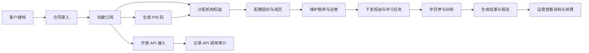
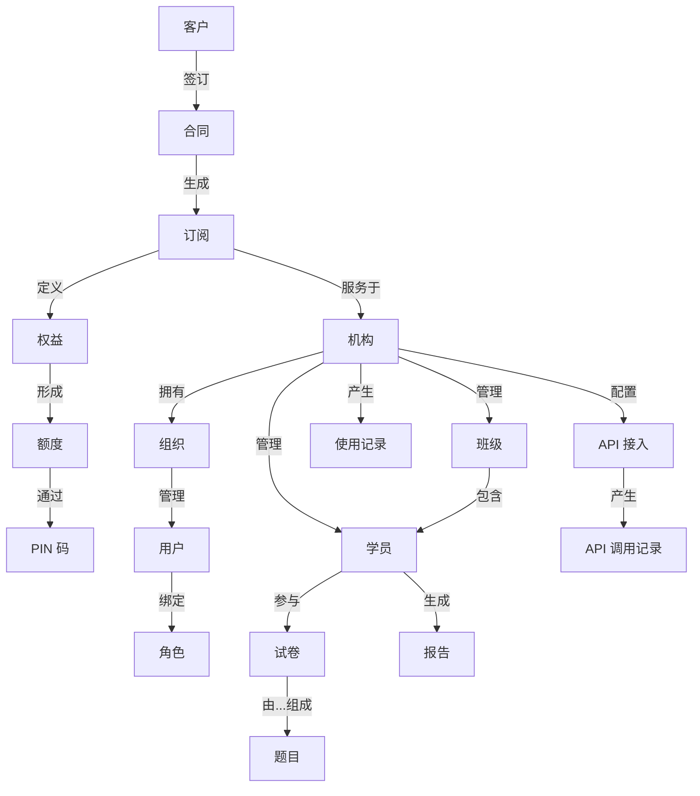

# IELTS Up B2B Platform 需求设计评审

## 1. 文档目的

本文档用于对 Magic Patterns 设计稿 `IELTS Up B2B Platform_v3 Zhanxi` 进行需求设计评审，帮助产品、设计、研发在进入详细设计和开发前对产品目标、模块边界、核心流程、数据对象和实现风险形成一致理解。

说明：
- 本文档基于 Magic Patterns 设计链接与当前 artifact 页面结构整理。
- 由于当前可获取信息以页面与组件命名为主，部分业务语义属于高可信推断，已在文中标注“需确认”。

## 2. 设计来源

- 设计地址：https://www.magicpatterns.com/c/7crzvhakdvxvi6ctkha8gr/preview
- 设计名称：`IELTS Up B2B Platform_v3 Zhanxi`
- 当前设计特征：多页面后台管理平台，面向机构客户的 B2B 管理场景。

## 3. 产品定位

从页面结构判断，该系统是一套服务于雅思教育机构或企业客户的运营管理平台，覆盖以下能力：

- 机构后台首页与数据看板
- 组织与成员管理
- 客户与合同管理
- 产品配额与订阅管理
- 题库、试卷、PIN 码等考试资源管理
- 学员、班级、分组与练习过程管理
- 报告与结果分析
- API 能力与调用记录管理

## 4. 目标用户

当前设计至少覆盖以下角色：

### 4.1 平台管理员

负责整体产品配置、机构开通、配额分配、API 管理、合同与订阅运营。

### 4.2 机构管理员

负责本机构成员、班级、学员、试卷、题库、学习安排与结果查看。

### 4.3 运营或销售角色

负责客户信息、合同录入、订阅续费、额度追踪、使用情况回溯。

### 4.4 教学或教务角色

负责题库维护、组卷、练习安排、报告查看与学员跟进。

说明：角色划分需结合 `OrgManagement`、`RoleManagement` 页面在评审会上进一步确认。

## 5. 总体信息架构

根据当前页面命名，平台信息架构可拆分为 8 个模块。

### 5.1 仪表盘与首页

- Institution Dashboard
- Welcome Header
- Product Quota Cards
- Smart Alerts
- Data Dashboard Tabs
- Batch Quick Actions

该模块承担首页概览作用，应集中展示机构状态、产品额度、关键指标、异常提醒与快捷入口。

### 5.2 组织与权限管理

- Org Management
- Org Structure Tab
- User Management Tab
- Role Management Tab
- Member Management
- Change Password

该模块用于定义组织层级、成员账号、角色权限和个人密码管理，是整个系统的权限基础模块。

### 5.3 客户、合同与订阅管理

- Customer List / Detail
- Add Contract / Edit Contract / Manage Contract / Client Contract
- Subscription List / Detail
- View Entitlement
- Credit Detail
- Quota Overview
- Usage History

该模块对应典型 B2B 商业化链路：客户建档、合同签约、产品订阅、权益查看、额度消耗与对账回溯。

### 5.4 教学资源与考试内容管理

- Paper List / Paper Detail / Create Paper
- Create Paper Modal
- Question Detail
- ScoreUp Bank / Question Detail
- SpeakUp Bank / Question Detail
- WriteUp Bank

该模块用于管理题库、试卷和不同能力维度的内容资源。当前命名显示产品可能按 `ScoreUp`、`SpeakUp`、`WriteUp` 分为不同训练线。

### 5.5 PIN 码与配额运营

- Pincode List / Detail / Create Pincode
- Product Quota Cards
- Quota Overview
- View Entitlement

该模块可能用于批量生成兑换码、授权码或课程激活码，并与机构权益及可用额度联动。

### 5.6 学员与教学执行管理

- Candidate List / Detail
- Student Groups
- Class Management
- Arrange TDP
- Manage TT
- Upload TT

该模块面向机构内部教学执行，覆盖学员管理、班级分配、分组、训练任务配置与上传类流程。

说明：`TDP`、`TT` 具体业务含义需确认，建议在评审中补充术语定义。

### 5.7 结果与报告中心

- Result Reporting
- ScoreUp Reporting / Report Detail
- SpeakUp Reporting / Report Detail
- WriteUp Reporting / Report Detail

该模块负责结果汇总、能力维度分析和详细报告查看，应支持按学员、班级、机构、时间维度筛选。

### 5.8 API 与开放能力

- API Management
- API Call Records

该模块表明平台存在对外系统集成能力，需关注 API Key、调用配额、调用审计与异常告警。

## 6. 核心数据对象

从设计结构可推断的主要业务对象如下：

- 机构：平台服务对象，承载组织、成员、配额和订阅。
- 用户：登录账号，可归属某个机构并关联角色。
- 角色：定义功能权限与数据访问边界。
- 客户：销售或运营视角下的商业客户实体。
- 合同：客户购买关系的法律与商务记录。
- 订阅：合同下的实际产品权益与生效周期。
- 权益/额度：不同产品线可分配和消耗的资源。
- PIN 码：可能用于激活、兑换或分发权益。
- 学员：机构服务对象，参与学习、练习和报告生成。
- 班级/分组：学员组织方式，用于运营和教学管理。
- 题目/题库：训练内容最小单元。
- 试卷：由题目组合成的练习或测评资源。
- 报告：针对练习结果形成的分析结果。
- API 调用记录：对外接口使用痕迹和审计数据。

## 7. 核心业务流程

### 7.1 客户签约到机构开通

1. 创建客户档案。
2. 录入或编辑合同。
3. 创建订阅并配置产品权益。
4. 为机构分配额度或可用资源。
5. 机构管理员开始管理成员和学员。

### 7.2 机构内部开通流程

1. 配置组织结构。
2. 创建角色并分配权限。
3. 邀请或创建成员账号。
4. 为成员分配岗位职责。
5. 进入班级、学员和内容管理。

### 7.3 内容生产与练习发布

1. 维护题库或查看题目详情。
2. 组装试卷或创建练习资源。
3. 通过班级、分组或任务配置将内容下发。
4. 学员参与训练。
5. 系统生成结果与能力报告。

### 7.4 配额消耗与运营追踪

1. 查看机构当前产品权益与额度。
2. 生成或分发 PIN 码。
3. 跟踪使用历史和消耗明细。
4. 对异常消耗触发提醒。
5. 在续费或扩容前进行额度评估。

### 7.5 API 接入与审计

1. 在 API 管理页面生成或维护接入配置。
2. 客户系统发起接口调用。
3. 平台记录调用记录、错误状态与流量情况。
4. 运营或技术人员对异常调用进行排查。

## 8. Mermaid 图示

以下 Mermaid 图用于需求评审时快速对齐业务流转和核心实体关系。当前图示基于现有设计结构抽象，适合作为评审版，不建议直接替代详细领域建模文档。

### 8.1 核心业务流程图

图示说明：

- 主链路从客户签约开始，最终进入学员训练、报告产出和商业续费闭环。
- `PIN 码` 与 `机构权益分配` 存在直接关联，适合评审时确认其业务位置。
- `API 接入` 是订阅后的并行能力，不一定属于所有客户的标准流程。

### 8.2 核心实体关系图

图示说明：

- 商业对象主链为 `客户 -> 合同 -> 订阅 -> 权益/额度 -> 机构`。
- 组织对象主链为 `机构 -> 组织 -> 用户 -> 角色`。
- 教学对象主链为 `机构 -> 班级/学员 -> 试卷 -> 报告`。
- 开放平台对象主链为 `机构/API 接入 -> API 调用记录`。

说明：若后续确认 `Customer` 与 `Institution` 是同一实体的不同视角，可在正式 PRD 中合并建模。

## 9. 首页设计评审重点

从组件命名看，首页至少包括以下区域：

- 欢迎区：展示机构身份、账号入口和总览入口。
- 配额卡片区：展示不同产品的可用额度、已用额度或剩余额度。
- 智能提醒区：承载风险、到期、异常或待处理事项。
- 数据标签区：切换不同统计视角。
- 批量快捷操作区：承载高频入口，如创建试卷、生成 PIN 码、导入数据等。

评审时建议重点确认：

- 首页的首屏目标是“经营总览”还是“业务操作入口”。
- 配额卡片的指标口径是否统一。
- 智能提醒是否可直接跳转到处理页面。
- 仪表盘的筛选维度是否与报告中心一致。
- 快捷操作是否按角色动态显示。

## 10. 页面级需求建议

### 10.1 登录页

建议明确：

- 登录方式：账号密码、机构码、SSO 或短信验证码。
- 错误提示策略与锁定策略。
- 是否支持首次登录改密。

### 10.2 组织管理页

建议明确：

- 组织树是否支持多层级。
- 用户是否必须归属部门。
- 角色权限是否支持复制模板。
- 是否区分菜单权限和数据权限。

### 10.3 客户与合同页

建议明确：

- 客户与机构是否一一对应。
- 合同是否支持多产品、多周期和补充协议。
- 订阅生效、续费、暂停、失效的状态流转。

### 10.4 题库与试卷页

建议明确：

- 题目分类维度。
- 试卷创建方式：手动组卷、规则组卷或模板组卷。
- 是否有审核状态、发布状态和版本机制。

### 10.5 学员与报告页

建议明确：

- 学员和班级之间的关系模型。
- 报告按产品线是否采用统一结构。
- 是否支持机构级导出、对比分析和趋势分析。

### 10.6 API 页

建议明确：

- API 授权方式。
- 调用限流与配额策略。
- 调用日志保留周期。
- 错误码与告警策略。

## 11. 当前设计中的待确认问题

以下问题建议作为需求评审的必答项：

1. 平台是单租户后台还是标准多租户 SaaS 后台。
2. `Customer`、`Institution`、`Organization` 三者是否为不同业务层级。
3. `Quota`、`Credit`、`Entitlement` 在业务上如何区分。
4. `Pincode` 的使用场景是激活账号、兑换课程还是发放权益。
5. `ScoreUp`、`SpeakUp`、`WriteUp` 是否为独立产品线。
6. `Arrange TDP`、`Manage TT`、`Upload TT` 的缩写语义与流程位置。
7. 报告页面是否只读，还是允许人工批注、复核或二次发布。
8. API 能力是仅供 B2B 客户对接，还是同时服务内部系统。
9. 成员管理与用户管理的边界是否不同。
10. 运营后台和机构后台是否共享同一套导航结构。

## 12. 主要风险与实现关注点

### 12.1 权限复杂度风险

若同时存在平台管理员、机构管理员、教师、运营、销售等多角色，权限模型必须尽早确定，否则后续页面联调成本会明显上升。

### 12.2 商业对象定义不清风险

若客户、机构、合同、订阅、配额之间关系没有统一模型，后续统计、计费、对账和权限判断都会产生歧义。

### 12.3 产品线割裂风险

若 `ScoreUp`、`SpeakUp`、`WriteUp` 页面交互差异过大，会导致后台使用成本高、组件复用差、研发维护成本上升。

### 12.4 数据口径不一致风险

首页、配额总览、使用历史、报告中心若统计口径不一致，会直接影响机构客户对平台可信度的判断。

### 12.5 高级功能可落地性风险

若智能提醒、批量操作、开放 API 已进入设计稿，但后端规则引擎、审计能力和异步处理机制尚未准备，需要在评审时明确落地范围。

## 13. 评审结论建议模板

建议评审会议按以下结论模板输出：

- 已确认范围：本期必须上线的页面、功能、角色与产品线。
- 待补充需求：术语定义、状态流转、数据口径、权限矩阵。
- 待优化设计：首页信息密度、导航分组、页面跳转链路、异常提示。
- 技术前置项：统一领域模型、权限模型、报表口径、审计日志方案。
- 延后项：若 API、高级告警、复杂报表不在首期，应明确降级方案。

## 14. 推荐下一步产出

基于当前设计，建议补充以下配套文档：

1. 角色权限矩阵表。
2. 核心实体关系图。
3. 合同-订阅-权益-额度状态流转图。
4. 首页指标口径说明。
5. 各页面字段级 PRD 明细。
