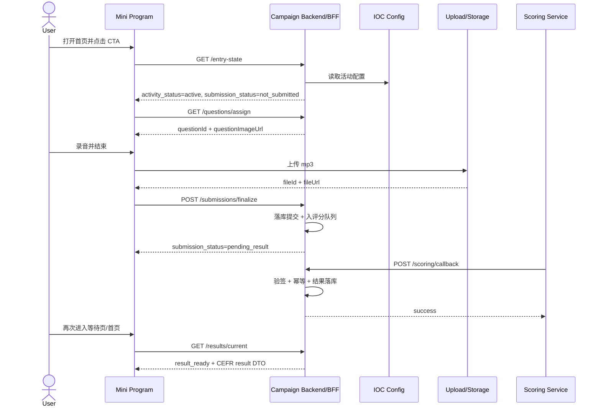
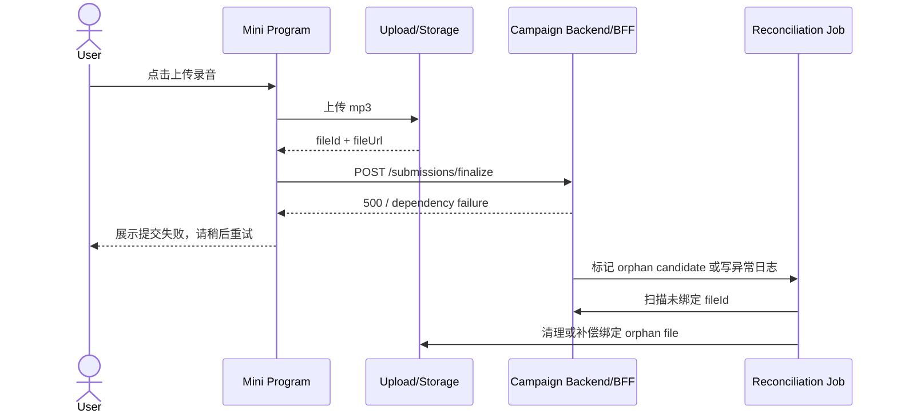
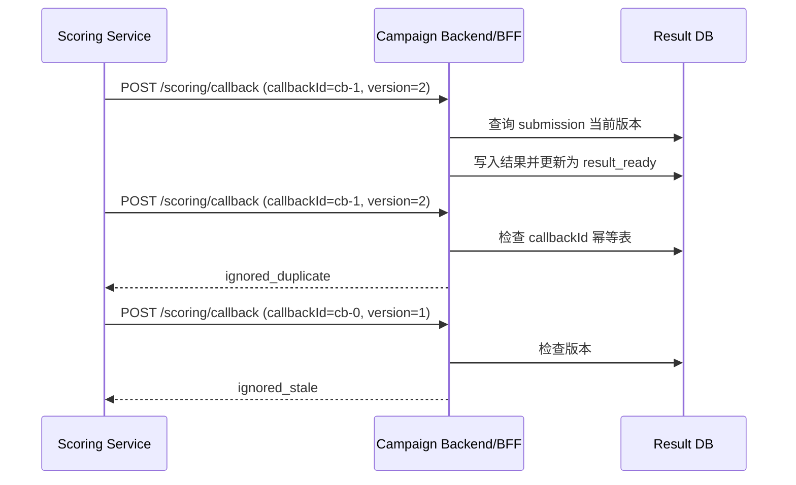

# Engineering Review - spkchallengpart2-miniprogram

## 0. Scope Challenge

Scope Challenge:
  最小变更集:
    必须改动: [Mini program frontend, Campaign Backend/BFF, Upload/Storage integration, Scoring callback endpoint, IOC admin activity config]
    可延迟:   [分享来源埋点细化, 回调失败告警阈值配置化, 补偿运营后台可视化, 素材 CMS 化]
    可绕过:   [不新增独立服务，复用现有 Campaign Backend 作为状态真相；不做实时推送，等待页在页面进入和回到前台时轮询；结果素材首期使用 IOC admin 配置或静态映射，不引入新 CMS]

  Complexity Smell: ⚠️ 已 Flag

  结论: 【范围基本合理，继续评审；但因集成点 > 3，需坚持 MVP 只复用既有 Upload/Storage 与 Scoring Service，不新增服务边界】

### 0.1 最小变更集审查

| 问题 | 结论 |
|---|---|
| 这次交付的最小可行变更集是什么？ | 小程序需新增首页状态机、录音页、等待页、结果页；Backend 需新增/扩展用户状态查询、题目分配、提交 finalize、结果查询、评分回调；Storage 需支持 mp3 上传；运营配置需支持活动开关、Banner、题图与 CEFR 素材映射 |
| 哪些工作可以推迟到下一个迭代？ | 分享裂变分析、来源归因、人工补偿后台、告警阈值配置化、题库分组策略、多 campaign 复用 UI |
| 有哪些看起来必须做但其实可以绕过的依赖？ | 无需 WebSocket；等待页采用查询/回前台刷新即可。无需新增结果内容服务；首期可由 Backend 结合静态配置输出结果资源与固定文案 |

### 0.2 Complexity Smell Check

⚠️ Complexity Smell Detected  
触发原因: 集成点超过 3 个（Mini program / Campaign Backend / Upload-Storage / Scoring Service / IOC admin config）；预计跨前后端与配置链路改动文件数大于 8。  
建议: 维持单 Epic 交付，但以“复用现有服务 + 禁止新增服务”为范围约束，避免在本期叠加裂变埋点配置化和补偿后台。

## 1. Review Scope

- 本次评审范围
  - 基于 [PRD/SPKChallenge/spkchallengpart2-miniprogram.md](/Users/frankzhey/Documents/AI%20Doc/ReposPM/ProductPortfolio/PRD/SPKChallenge/spkchallengpart2-miniprogram.md)、[docs/spkchallengpart2-miniprogram-ux.md](/Users/frankzhey/Documents/AI%20Doc/ReposPM/ProductPortfolio/docs/spkchallengpart2-miniprogram-ux.md)、[UI/spkchallengpart2-miniprogram-prototype.html](/Users/frankzhey/Documents/AI%20Doc/ReposPM/ProductPortfolio/UI/spkchallengpart2-miniprogram-prototype.html) 输出研发实现评审文档
  - 覆盖身份绑定、首页状态机、录音与上传、等待页、异步回调、CEFR 结果页
- 输入来源
  - PRD
  - UX 文档
  - HTML 原型
  - [context-memo.md](/Users/frankzhey/Documents/AI%20Doc/ReposPM/ProductPortfolio/context-memo.md)
- 当前假设
  - 复用现有 Campaign Backend/BFF、Upload/Storage、Scoring Service 语境
  - 微信授权链路可稳定返回 `unionId` 或可通过既有服务完成绑定
  - IOC admin 可提供活动开关、Banner 与结果素材配置
- 不在本次评审范围内的内容
  - 分享素材最终文案与分享来源埋点字段定稿
  - 回调失败补偿后台页面实现
  - 多 campaign 复用设计与运营后台复杂配置 UI

## 2. Feature / Epic Context

- Epic Name
  - `spkchallengpart2-miniprogram`
- Feature Name
  - Mini program speaking Part 2 campaign submission and result lifecycle
- 当前业务目标
  - 通过微信小程序活动页获取有效 `unionId` 级别的 Part 2 音频样本，并在异步出分后展示 CEFR 结果
- 用户价值
  - 用户能明确知道是否可参与、录音是否提交成功、何时查看结果，以及最终得到可理解的口语等级反馈
- 关键流程摘要
  - WeChat auth -> entry state query -> question assignment -> local recording -> mp3 upload -> finalize submission -> pending result -> scoring callback -> result query/render

## 3. High-level Architecture Design

### 整体架构说明

本功能建议采用“前端轻交互 + Backend 持有状态真相 + 异步评分回调”的三层架构：

1. Mini program 负责授权触发、题图渲染、录音控制、分享触发和状态展示。
2. Campaign Backend/BFF 负责 `unionId` 绑定、活动状态判断、`questionId` 分配、提交 finalize、防重复提交、结果查询。
3. Upload/Storage 负责文件接收和对象存储。
4. Scoring Service 负责异步评分并通过 callback 回写结果。
5. IOC admin 负责活动配置、题图、Banner、结果资源映射。

### 当前功能所在系统位置

- 渠道层: WeChat Mini Program
- 应用层: Campaign Backend/BFF
- 数据层: Campaign DB + File Metadata DB/Object Storage + Result DB
- 外部依赖: WeChat auth capability, Upload/Storage, Scoring Service, IOC admin config

### 主要组件与外部依赖

- Mini program UI Shell
- Auth/Identity module
- Campaign State Service
- Question Assignment Service
- Submission Finalize Service
- Result Query Service
- Scoring Callback Handler
- Reconciliation Job

### 同步 / 异步边界

- 同步
  - Entry state query
  - Question assignment
  - Upload init / finalize submission
  - Result query
- 异步
  - Scoring processing
  - Callback result ingestion
  - Reconciliation / retry / orphan cleanup

## 4. High-level Components Architecture / Application Diagram

| Component | 职责 | 调用方向 | 数据流向 | Sync / Async |
|---|---|---|---|---|
| Mini Program App | 页面切换、CTA 状态渲染、录音控制、分享触发 | User -> Mini Program -> BFF | UI state, local recording draft | Sync |
| Auth Bridge | 微信授权、`unionId` 获取与会话恢复 | Mini Program -> WeChat / BFF | `unionId`, session token | Sync |
| Campaign Entry API | 查询 `activity_status` / `submission_status` / CTA 文案信息 | Mini Program -> BFF | entry state DTO | Sync |
| Question Assignment API | 分配并返回固定 `questionId` 和题图资源 | Mini Program -> BFF | `questionId`, `questionImageUrl` | Sync |
| Upload/Storage | 接收 mp3，返回 `fileId` / `fileUrl` | Mini Program -> Storage | file binary, metadata | Sync |
| Submission Finalize API | 校验单次提交、保存提交记录、入评分队列 | Mini Program -> BFF | `submissionId`, submission metadata | Sync + async enqueue |
| Scoring Queue / Service | 异步评分处理 | BFF -> Scoring | scoring task payload | Async |
| Callback Handler | 校验 callback、落库结果、更新状态 | Scoring -> BFF | `submissionId`, `cefrLevel`, callback metadata | Async |
| Result Query API | 查询结果页展示数据 | Mini Program -> BFF | result DTO | Sync |
| IOC admin config | 活动开关、Banner、题图、结果资源配置 | BFF -> IOC config | config payload | Sync |

## 5. System Interaction Flow

### User -> Channel -> Gateway -> Services -> Data

1. 用户打开小程序首页。
2. Mini program 请求 Campaign Entry API。
3. BFF 从 session / auth bridge 中确认 `unionId`，再查询活动配置与用户提交状态。
4. 若允许参与，Mini program 请求 Question Assignment API，获得固定 `questionId` 与题图。
5. 用户在本地录音，完成后上传 mp3 到 Upload/Storage。
6. Mini program 调用 Submission Finalize API，带上 `unionId`、`campaignId`、`questionId`、`fileId`、duration 等元数据。
7. BFF 以事务方式完成“单次提交校验 + 提交记录落库 + 文件元数据绑定 + 评分任务入队”。
8. 用户进入 Waiting page。
9. Scoring Service 完成评分后，向 Callback Handler 发起带签名的 callback。
10. BFF 校验签名、幂等键、状态版本后写入结果记录并更新 `submission_status=result_ready`。
11. 用户进入首页或等待页时，Mini program 通过 Result Query API 获取结果页 DTO 并渲染 CEFR 页面。

### 关键节点说明

- 触发点
  - 首页 CTA 点击
  - 开始录音 / 结束录音 / 上传录音
  - 分享触发
  - callback 到达
- 返回点
  - entry state DTO
  - question DTO
  - finalize success DTO
  - result DTO
- 外部系统交互点
  - WeChat auth
  - Upload/Storage
  - Scoring callback
  - IOC admin config

## 6. Service Boundary Table

| Service / Component | Owns | Does NOT Own | Notes |
|---|---|---|---|
| Mini program | 页面交互、录音控制、分享触发、状态渲染 | 活动状态真相、结果计算、结果固定文案存储 | 前端禁止自行推导 `submission_status` |
| Campaign Backend/BFF | `unionId` 绑定、活动状态机、题目分配、提交 finalize、防重、结果查询 | 微信底层授权、评分算法内部逻辑、对象存储实现 | 建议以 `submissionId` 串联业务链路 |
| Upload/Storage | 文件上传、对象存储、文件元数据基础字段 | 提交状态流转、评分任务 | 文件与业务记录解耦，但需补偿 |
| Scoring Service | 评分任务处理、CEFR 计算、callback 回传 | 活动规则、前端页面渲染 | 必须支持 callback 幂等与重试 |
| IOC admin / Config | 活动开关、Banner、题图资源、CEFR 素材映射 | 用户交互流程、评分结果计算 | 首期可采用静态配置或既有配置表 |
| Touch points | 漏斗埋点采集 | 业务状态决策 | 仅作为观察层，非状态真相 |

## 7. Key Technical Decisions

### Decision 1: 以 `unionId + campaignId` 作为唯一成功提交约束

- 决策
  - Campaign Backend 对同一 `unionId + campaignId` 最多只允许 1 次成功提交
- 原因
  - 保证样本质量、防刷量、防重复结果

爆炸半径评估:
  影响系统: [Mini program, Campaign Backend, Upload/Storage, Scoring Service]
  影响用户: [当前活动全量参与用户]
  数据风险: [有，若约束错误会产生重复提交和重复结果]
  回滚能力: [可快速回滚，回滚为放宽约束或临时人工修复重复记录]
  隔离方案: [feature flag]
  风险等级: [High]

### Decision 2: 使用 upload + finalize 两阶段提交，而不是前端一次性直写业务成功

- 决策
  - 先上传文件，再由 finalize API 原子完成业务提交、元数据绑定与入队
- 原因
  - 防止“文件上传成功但业务失败”被误判为提交完成

爆炸半径评估:
  影响系统: [Mini program, Upload/Storage, Campaign Backend]
  影响用户: [所有完成录音并点击上传的用户]
  数据风险: [有，若 finalize 设计不当会产生孤儿文件或脏状态]
  回滚能力: [需人工干预，特别是已有孤儿文件时]
  隔离方案: [feature flag + reconciliation job]
  风险等级: [High]

### Decision 3: 评分结果采用 async callback 主导，等待页只查询不推送

- 决策
  - 不做 WebSocket 或前台主动长连接，等待页通过页面进入和回前台刷新结果
- 原因
  - 降低渠道复杂度，适配小程序特性，聚焦 MVP

爆炸半径评估:
  影响系统: [Mini program, Campaign Backend, Scoring Service]
  影响用户: [已提交但未出分用户]
  数据风险: [无直接写错风险，但会影响结果可见延迟]
  回滚能力: [可快速回滚]
  隔离方案: [无]
  风险等级: [Medium]

### Decision 4: callback 必须具备 signature verification + idempotency + version check

- 决策
  - Callback Handler 需要校验签名、回调幂等键和状态版本，拒绝重复/乱序回调
- 原因
  - 避免错误出分、重复结果、状态回退

爆炸半径评估:
  影响系统: [Campaign Backend, Scoring Service, Result Query API]
  影响用户: [已提交且等待出分用户]
  数据风险: [有，若失效会直接污染结果表]
  回滚能力: [需人工干预，污染后需要数据修复]
  隔离方案: [canary]
  风险等级: [High]

### Decision 5: `questionId` 在同一未成功上传尝试内固定，不因重录重抽

- 决策
  - 一旦分配题目，在当前未成功上传前保持同一 `questionId`
- 原因
  - 保持行为稳定，避免题目与录音元数据不一致

爆炸半径评估:
  影响系统: [Mini program, Campaign Backend]
  影响用户: [未提交用户]
  数据风险: [有，若重抽题会破坏题目与音频对应关系]
  回滚能力: [可快速回滚]
  隔离方案: [feature flag]
  风险等级: [Medium]

### Decision 6: 结果鼓励文案按 `submissionId` 首次生成后固定

- 决策
  - BFF 首次组装结果页 DTO 时固定 `resultCopyId` / `resultCopyText`，后续查询直接返回同一值
- 原因
  - 避免用户刷新页面看到不同结果文案，提升结果一致性

爆炸半径评估:
  影响系统: [Campaign Backend, Mini program]
  影响用户: [所有已出分用户]
  数据风险: [低，主要是展示一致性]
  回滚能力: [可快速回滚]
  隔离方案: [feature flag]
  风险等级: [Low]

## 8. Sequence Diagrams

### 8.1 Happy Path: 首次参与并成功出分

### 8.2 Failure Path: 文件上传成功但 finalize 失败

### 8.3 Edge Case: 重复/乱序 callback

## 9. Database ERD / Data Model

### 核心实体

| Entity | PK | FK | 关键字段 | Ownership | Notes |
|---|---|---|---|---|---|
| `campaign_participant` | `participant_id` | - | `union_id_hash`, `campaign_id`, `auth_status`, `created_at` | Campaign Backend | 每个用户在活动中的身份绑定记录 |
| `campaign_question_assignment` | `assignment_id` | `participant_id` | `campaign_id`, `question_id`, `assignment_status`, `assigned_at` | Campaign Backend | 当前未提交录音尝试内固定 `questionId` |
| `audio_file_record` | `file_id` | `participant_id`, `assignment_id` | `storage_url`, `format`, `duration_seconds`, `file_size`, `upload_status`, `uploaded_at` | Upload/Storage + BFF metadata | 纯文件元数据，不代表业务提交成功 |
| `campaign_submission` | `submission_id` | `participant_id`, `file_id`, `assignment_id` | `campaign_id`, `submission_status`, `submitted_at`, `idempotency_key` | Campaign Backend | 业务主表，单活动唯一成功提交 |
| `scoring_task` | `scoring_task_id` | `submission_id` | `provider_name`, `queue_status`, `retry_count`, `next_retry_at` | Campaign Backend / Scoring bridge | 追踪入队与补偿 |
| `scoring_result` | `result_id` | `submission_id`, `scoring_task_id` | `cefr_level`, `result_copy_id`, `result_copy_text`, `provider_score_raw`, `result_version`, `received_at` | Campaign Backend | 最终结果记录 |
| `callback_event_log` | `callback_event_id` | `submission_id`, `scoring_task_id` | `callback_id`, `signature_status`, `payload_hash`, `process_status`, `error_code`, `received_at` | Campaign Backend | callback 幂等与审计 |
| `campaign_asset_mapping` | `asset_mapping_id` | - | `campaign_id`, `cefr_level`, `banner_type`, `image_url`, `background_url`, `copy_pool_json` | IOC admin / Config | 活动素材配置 |

### 状态字段建议

#### `campaign_submission.submission_status`

| Value | Meaning |
|---|---|
| `not_submitted` | 当前活动无成功提交 |
| `pending_result` | 提交成功，等待评分 |
| `result_ready` | 结果已可展示 |

#### `audio_file_record.upload_status`

| Value | Meaning |
|---|---|
| `uploaded` | 文件已成功写入对象存储 |
| `binding_failed` | 文件已上传但业务绑定失败 |
| `cleaned` | 孤儿文件已清理 |

#### `callback_event_log.process_status`

| Value | Meaning |
|---|---|
| `accepted` | callback 被成功消费 |
| `duplicate_ignored` | 重复 callback 被忽略 |
| `stale_ignored` | 乱序旧版本被忽略 |
| `rejected` | 签名或字段校验失败 |

### 实体关系

- `campaign_participant` 1:N `campaign_question_assignment`
- `campaign_question_assignment` 1:N `audio_file_record`
- `campaign_submission` 1:1 `audio_file_record` for final selected file
- `campaign_submission` 1:N `callback_event_log`
- `campaign_submission` 1:1 `scoring_result`

## 10. API Document

### API 1: Get Entry State

| Field | Value |
|---|---|
| API Name | Get Entry State |
| Endpoint | `GET /api/campaigns/{campaignId}/entry-state` |
| Method | `GET` |
| Purpose | 返回首页所需活动状态、提交状态、Banner 类型和 CTA 文案 |
| Auth | WeChat session / backend token |
| Permission | 已授权用户；未授权用户返回 `auth_required` |
| Request Fields | `campaignId` |
| Response Fields | `activityStatus`, `submissionStatus`, `bannerType`, `ctaPrimaryText`, `ctaSecondaryText`, `latestSubmissionId?` |
| Error Model | `AUTH_REQUIRED`, `CAMPAIGN_NOT_FOUND`, `DEPENDENCY_FAILURE`, `SYSTEM_ERROR` |
| Retry | 前端可在可恢复错误下手动重试 |
| Timeout | 2s - 3s |

### API 2: Assign Question

| Field | Value |
|---|---|
| API Name | Assign Question |
| Endpoint | `POST /api/campaigns/{campaignId}/questions/assign` |
| Method | `POST` |
| Purpose | 返回固定 `questionId` 和题图资源；同一未成功上传尝试内重复进入返回同一题目 |
| Auth | Required |
| Permission | `submissionStatus=not_submitted` |
| Request Fields | `campaignId` |
| Response Fields | `assignmentId`, `questionId`, `questionImageUrl`, `promptText?` |
| Error Model | `AUTH_REQUIRED`, `CAMPAIGN_ENDED`, `ALREADY_SUBMITTED`, `QUESTION_POOL_EMPTY`, `SYSTEM_ERROR` |
| Retry | 可重试；同一幂等上下文应返回相同题目 |
| Timeout | 2s |

### API 3: Upload Finalize Submission

| Field | Value |
|---|---|
| API Name | Finalize Submission |
| Endpoint | `POST /api/campaigns/{campaignId}/submissions/finalize` |
| Method | `POST` |
| Purpose | 原子完成单次提交校验、文件绑定、提交记录落库、评分任务入队 |
| Auth | Required |
| Permission | `submissionStatus=not_submitted` |
| Request Fields | `campaignId`, `assignmentId`, `questionId`, `fileId`, `durationSeconds`, `fileSize`, `format`, `idempotencyKey` |
| Response Fields | `submissionId`, `submissionStatus`, `submittedAt` |
| Error Model | `ALREADY_SUBMITTED`, `INVALID_FILE`, `FILE_NOT_FOUND`, `DEPENDENCY_FAILURE`, `SYSTEM_ERROR` |
| Retry | 可重试，但必须使用相同 `idempotencyKey` |
| Timeout | 4s - 6s |

### API 4: Get Current Result

| Field | Value |
|---|---|
| API Name | Get Current Result |
| Endpoint | `GET /api/campaigns/{campaignId}/results/current` |
| Method | `GET` |
| Purpose | 返回等待页或结果页展示 DTO |
| Auth | Required |
| Permission | 仅当前 `unionId` 对应提交可读 |
| Request Fields | `campaignId` |
| Response Fields | `submissionStatus`, `submissionId`, `cefrLevel?`, `cefrImageUrl?`, `cefrBackgroundUrl?`, `resultCopyText?`, `learnMoreUrl?` |
| Error Model | `AUTH_REQUIRED`, `RESULT_NOT_READY`, `RESULT_INVALID`, `FORBIDDEN`, `SYSTEM_ERROR` |
| Retry | 结果未就绪时前端可再次查询 |
| Timeout | 2s |

### API 5: Receive Scoring Callback

| Field | Value |
|---|---|
| API Name | Receive Scoring Callback |
| Endpoint | `POST /api/internal/scoring/callback` |
| Method | `POST` |
| Purpose | 接收评分服务回调并更新结果 |
| Auth | Provider signature / allowlist |
| Permission | 仅 Scoring Service |
| Request Fields | `callbackId`, `submissionId`, `taskId`, `cefrLevel`, `providerScoreRaw`, `version`, `timestamp`, `signature` |
| Response Fields | `processStatus`, `message` |
| Error Model | `SIGNATURE_INVALID`, `SUBMISSION_NOT_FOUND`, `INVALID_RESULT`, `DUPLICATE_CALLBACK`, `STALE_CALLBACK`, `SYSTEM_ERROR` |
| Retry | 仅对可重试错误返回 retryable response |
| Timeout | 3s |

## 11. Error Handling Strategy

| 场景 | 处理策略 | 用户反馈 | 系统处理 |
|---|---|---|---|
| 输入校验失败 | 前端先校验，BFF 再做最终校验 | 按钮禁用或提示重试 | 记录 validation log |
| WeChat 授权失败 | 留在首页，允许再次授权 | “授权失败，请稍后重试” | 记录 auth failure code |
| 题图获取失败 | 不允许进入录音 | “题目加载失败，请稍后重试” | 记录 config/dependency error |
| 上传失败 | 不展示成功提交，不清空本地录音 | “提交失败，请稍后重试” | 标记失败原因；必要时 orphan 扫描 |
| 重复提交 | 返回既有状态，不创建新记录 | “每位用户在本活动中仅可提交一次” | 命中唯一约束并返回 existing submission |
| callback 重复 | 忽略重复事件 | 无前端提示 | 记录 `duplicate_ignored` |
| callback 乱序 | 拒绝旧版本 | 无前端提示 | 记录 `stale_ignored` |
| 状态不一致 | 优先以 Backend 状态真相纠偏 | 前端显示等待或稍后重试 | 记录 reconciliation task |
| 部分成功 | 上传成功但 finalize 失败时走补偿 | 用户仍看到失败 | 触发 orphan cleanup / rebinding workflow |

## 12. Retry Strategy

### 哪些请求可重试

- `GET /entry-state`
- `POST /questions/assign`
- `POST /submissions/finalize` with same `idempotencyKey`
- Scoring callback 对可重试错误进行 provider-side retry

### 最大重试次数

- 前端同步 API: 0 次自动重试，用户手动触发
- finalize: 前端最多 1 次自动保护性重试或仅手动重试
- scoring callback: 建议 3 次 provider-side retry，采用指数退避
- reconciliation job: 定时扫描 `pending_result` 超时记录，每 30 分钟执行一次 [假设]

### 退避策略

- callback: exponential backoff，例如 1m / 5m / 15m
- reconciliation: cron + batch scan

### 幂等性要求

- finalize 以 `idempotencyKey` 去重
- callback 以 `callbackId + submissionId` 去重
- 结果表以 `submissionId` 保持唯一结果记录

### 最终失败如何补偿或告警

- finalize 失败 -> orphan file table + alert
- callback 连续失败 -> alert + pending_result aging monitor + manual replay
- 结果无效 -> 进入 invalid result queue，人工排查

## 13. Logging & Monitoring

### 日志字段

- `timestamp`
- `service_name`
- `trace_id`
- `request_id`
- `union_id_hash`
- `campaign_id`
- `question_id`
- `submission_id`
- `callback_id`
- `state_from`
- `state_to`
- `error_code`
- `retry_count`

### 关键业务日志

- entry state query result
- question assignment created / reused
- upload finalize success / fail
- duplicate submission blocked
- callback accepted / duplicate / stale / rejected
- result DTO rendered with `submissionId`

### 告警点

- Upload finalize failure rate > threshold
- `pending_result` aging > SLA threshold
- callback reject rate spikes
- orphan file count accumulation
- invalid `cefrLevel` result events

### 指标建议

- 首页 CTA 点击率
- auth success rate
- question assignment success rate
- upload success rate
- finalize success rate
- result ready median latency
- callback duplicate rate
- result page open rate

### 用户链路可观测性

- trace from `unionId_hash` -> `assignmentId` -> `fileId` -> `submissionId` -> `callbackId`

## 14. Non-functional Requirements

| Category | Requirement |
|---|---|
| Performance | 首页状态查询 P95 < 2s；结果查询 P95 < 2s；finalize P95 < 6s |
| Reliability | finalize 和 callback 均需幂等；状态真相只在 Backend |
| Scalability | 支持活动峰值同时上传；上传与评分处理解耦 |
| Compatibility | 适配主流微信小程序环境；录音能力失败需降级提示 |
| Security | `unionId` 脱敏存储；结果读取防越权；callback 验签 |
| Observability | trace id 串联全链路；关键转化率可观测 |
| Data Integrity | `unionId + campaignId` 唯一成功提交；结果与提交 1:1 |
| File Size | 2 分钟 mp3 需受文件大小上限约束，建议前后端同时校验 |
| Timeout | 同步接口 2s - 6s；callback 3s 内返回 |

## 15. Risks / Open Questions

### 技术风险

- `unionId` 获取链路在不同授权场景不稳定，可能导致身份绑定失败。
- finalize 两阶段提交若设计不严谨，会产生 orphan file。
- callback 若未做签名/幂等/版本校验，会直接污染结果表。

### 集成风险

- IOC admin 是否能按活动维度输出 Banner、题图和 CEFR 素材映射尚需确认。
- Scoring Service 是否支持回调签名、重试和幂等键尚需确认。

### 数据风险

- 结果鼓励文案固定策略若只做前端本地缓存，会在换设备/清缓存后失效；必须由 Backend 持久化。
- 题图固定策略若只做前端内存态，重进页面可能产生题目漂移。

### 依赖风险

- 分享链路的目标路径、标题、图片和来源埋点字段尚未确认。
- callback 失败后的最大重试次数、人工补偿入口和告警阈值尚未确认。

### 需要产品 / 设计 / 架构确认的问题

- 结果素材缺失时是否只走通用兜底页，还是要降级展示纯文本 CEFR。
- 分享触发后是否需要区分好友和朋友圈埋点事件。

### 🚨 AC 合规风险

  不合规 Story: [Story 1, Story 2, Story 3, Story 4, Story 6, Story 7]
  建议: PM 让 Product Planner 重新跑 Quality Gate（Step 10.5），修复后再交工程评审
  工程影响: AC 不合规会导致研发 estimation 偏差、QA 测试用例不完整、上线风险升高

## 16. Implementation Recommendation

### FE 建议

- 小程序前端只持有临时交互状态，不持有业务真相状态。
- 首页统一通过一个 entry state DTO 驱动双 CTA，避免本地条件分支漂移。
- 录音页本地只保存当前草稿文件句柄，上传成功前不要清空旧草稿。
- 结果页不要前端随机文案，必须消费 Backend 返回的固定 `resultCopyText`。

### BE 建议

- 将 entry state、question assignment、finalize、result query 设计为独立 API。
- 以数据库唯一约束 + 幂等键共同保护单次提交。
- callback handler 必须引入签名校验、幂等表、版本比较和审计日志。

### Integration 建议

- 与 Upload/Storage 采用 init/upload/finalize 风格，而不是前端直接把业务提交和文件上传耦合为单请求。
- 与 Scoring Service 明确 callback schema、signature、retryable error contract。

### QA 关注点

- 授权失败、活动结束、重复提交、录音权限拒绝、上传失败、callback 重复、结果资源缺失。
- D1-D4 已确认规则必须有单独测试用例：单次提交唯一、活动结束不阻断已提交用户、重录不换题、结果文案固定。

### DevOps / Monitoring 关注点

- 监控 `pending_result` aging 队列。
- 为 orphan file、callback reject、invalid result 配置告警。
- 保留 manual replay / reconciliation job 入口。

## 17.0 AC 合规校验

AC 合规校验:
  Story 总数: 8 个
  合规 Story 数: 2 个
  不合规 Story 数: 6 个

  不合规明细:
    Story 1 - WeChat authorization and unionId campaign identity binding:
      ❌ 覆盖缺失: 操作类 AC 未完整覆盖 A-8 弹窗所有关闭方式；授权弹窗拒绝已覆盖，但“关闭/收起授权弹窗”路径未独立说明
      建议: 退回 Product Planner 按 ac-writing-spec SKILL §2.1 修正

    Story 2 - Entry CTA state machine and event-ended behavior:
      ❌ 覆盖缺失: 操作类 AC 未显式覆盖 A-2 权限与配置依赖中的“无权限/未授权”场景
      ❌ 覆盖缺失: 操作类 AC 未显式覆盖 B-4 幂等性 / 重复触发；`not_submitted` 与 `result_ready` 状态下重复点击 CTA 的行为未独立说明
      建议: 退回 Product Planner 按 ac-writing-spec SKILL §2.1 修正

    Story 3 - Random question assignment and recording start flow:
      ❌ 覆盖缺失: 操作类 AC 未显式覆盖 B-4 幂等性 / 重复触发；重复点击开始录音、停止录音时的行为未独立说明
      建议: 退回 Product Planner 按 ac-writing-spec SKILL §2.1、§4.2 修正

    Story 4 - Post-recording review, playback, and re-record confirmation:
      ❌ 覆盖缺失: 操作类 AC 未显式覆盖 B-4 幂等性 / 重复触发；重复点击播放或重复确认重录后的系统行为未单独说明
      建议: 退回 Product Planner 按 ac-writing-spec SKILL §2.1、§4.2 修正

    Story 6 - Waiting page and social sharing while result is pending:
      ❌ 覆盖缺失: 操作类 AC 未显式覆盖 A-2 权限与配置依赖；未说明未提交用户或无有效提交用户访问等待页的拒绝行为
      ❌ 覆盖缺失: 操作类 AC 未显式覆盖 B-4 幂等性 / 重复触发；重复分享触发的行为未说明
      建议: 退回 Product Planner 按 ac-writing-spec SKILL §2.1 修正

    Story 7 - Async scoring callback ingestion and lifecycle state transition:
      ❌ 覆盖缺失: 操作类 AC 未显式覆盖 A-2 权限与配置依赖；callback 调用方签名/鉴权前置条件未进入 GIVEN
      建议: 退回 Product Planner 按 ac-writing-spec SKILL §2.1、§4.3 修正

  结论: 【6 个 Story 不合规需返工】

## 17. Task Planning Readiness

### Story-level Engineering Readiness

| Story | Recommended Domains | Main Dependencies | Main Complexity Drivers | Suggested Breakdown Hints | Suggested Estimation Risk Level |
|---|---|---|---|---|---|
| Story 1 | FE / BE / QA | WeChat auth, session bridge | `unionId` 绑定稳定性 | 先拆授权成功、失败、身份复用 | Medium |
| Story 2 | FE / BE / QA | IOC config, entry state API | CTA 状态矩阵 | 先固化状态真相 DTO，再落首页 UI | Medium |
| Story 3 | FE / BE / QA | question API, device recording | 录音权限与题目固定 | 先拆题目分配，再拆录音控制 | Medium |
| Story 4 | FE / QA | local recording draft | 重录确认与草稿生命周期 | 先拆确认弹窗，再拆播放/重录状态 | Medium |
| Story 5 | FE / BE / Integration / QA | Storage, finalize API | 原子性、防重、孤儿文件 | 先拆 upload/init，再拆 finalize + idempotency | High |
| Story 6 | FE / QA / Data | result polling, share capability | 等待态与分享不互相污染 | 等待页和分享埋点可并行 | Low |
| Story 7 | BE / Integration / Data / QA / DevOps | scoring callback contract | callback 幂等、重试、补偿 | 先拆 handler，再拆 reconciliation + alerting | High |
| Story 8 | FE / BE / QA | result query DTO, asset mapping | 结果素材、固定文案 | 先拆 DTO，再拆结果页映射与兜底 | Medium |

### Refinement Notes for Task Planner

- 适合先拆
  - Story 1 / 2 / 3 先完成，保证前台可进入正确路径
  - Story 5 与 Story 7 是高风险主链路，需尽早 refinement
- 可并行模块
  - 首页状态机与录音 UI 可并行
  - 等待页/结果页 FE 可在 API contract 固定后并行
  - callback handler 与 reconciliation / alerting 可并行
- 会影响 final unit 的依赖
  - Scoring callback contract
  - Upload/Storage finalize 模式
  - IOC admin 是否已支持结果素材映射
- 需要系统 owner / domain expert 参与
  - WeChat auth owner
  - Upload/Storage owner
  - Scoring Service owner
  - IOC admin config owner

## 18. Wiki Publishing Metadata

- Epic Name
  - `spkchallengpart2-miniprogram`
- 页面类型
  - `engineering-review`
- Wiki 路径
  - `/spkchallengpart2-miniprogram/engineering-review`